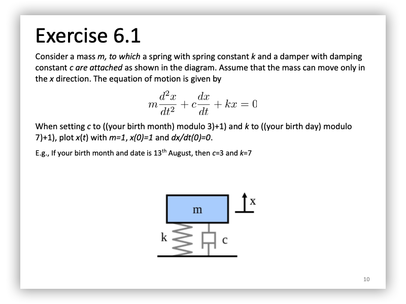
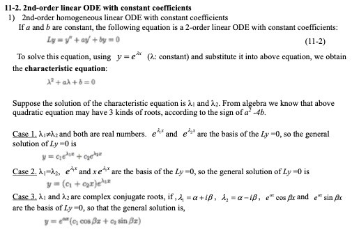
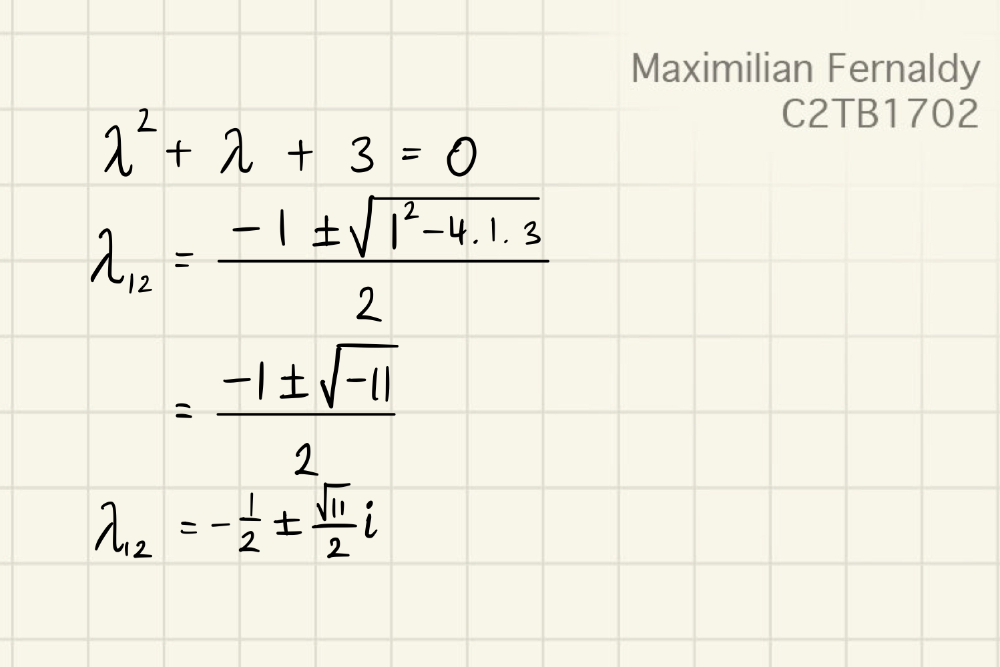
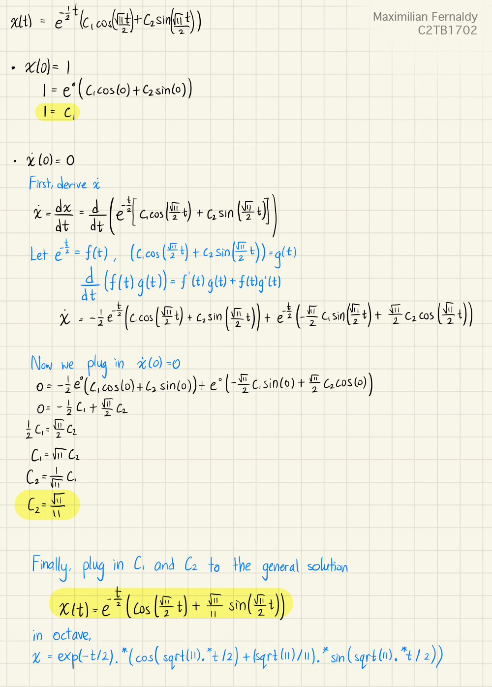
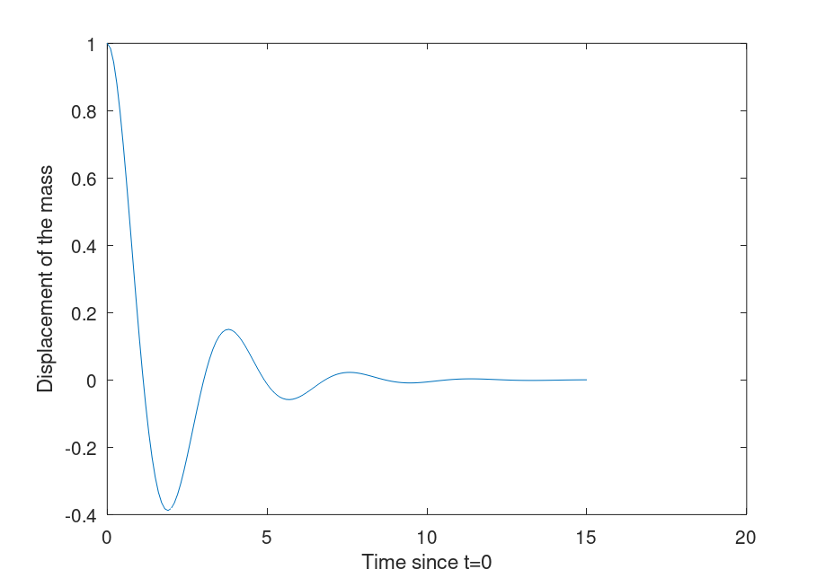
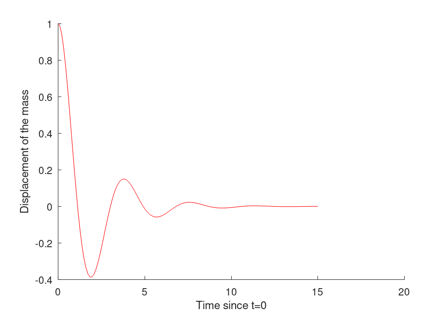
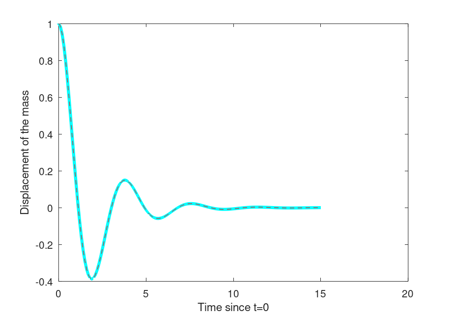

# Report 6
Maximilian Fernaldy - C2TB1702

*If you are viewing this report in .pdf format, some images might not be very clear as-is. You can view images in more detail by accessing the source folder <a href='https://drive.google.com/drive/folders/1xoUCSQAvp9lbTLtST0kAWboVuCRwt_MP?usp=sharing'>here</a>.*

[comment]: # (The line above is CSS code to change the cursor when hovering on images.)

  

## Given parameters

My birthday is on June 16.
1. Damping constant $c = (6mod3) + 1 = 1$
2. Spring constant $k = (16mod7) + 1 = 3$
3. Mass $m = 1$
4. Initial displacement $x(0)$ = 1
5. Initial velocity $\dfrac{dx}{dt}(0) = 0$

## Calculating the equation of motion

The equation of motion is given by
$$ m \frac{d^2x}{dt^2} + c \frac{dx}{dt} + kx = 0$$

Inserting our parameters, we get
$$ \frac{d^2x}{dt^2} + \frac{dx}{dt} + 3x = 0 $$

This is an Ordinary Differential Equation, or as I will call it from now on, an ODE. We can solve it by hand, but I will demonstrate why it is much, much easier and faster using Octave's ODE solvers.
## Modelling the motion manually

First, let's try to model this motion manually, and later plug in the solution into Octave so that we can get a plot of the movement along the $x$-axis.

Let's convert our equation of motion into Newtonian notation:

$$ \frac{d^2x}{dt^2} + \frac{dx}{dt} + 3x = 0 \implies \ddot{x} + \dot{x} + 3x = 0 $$

Where dots indicate the order of derivation with respect to $t$. We can see that this equation is more specifically a second-order homogenous linear ODE. The highest order of derivative of $x$ is 2, which is why the equation is second-order. All the components of this equation (other than zero) involve the function $x$, which means it is homogeneous, and all the functions $x$ also appear in the first order, which is why it is linear.

I will use the method in the "Exercise of Mathematics and Physics I" book written by Professor Ying Chen for the IMAC-U course. The part covering second-order homogeneous linear ODE can be accessed (with permission from the author) <a href='https://drive.google.com/open?id=1xtCYmRpNLYgHt3mjMGfocc99btX8Ryvl&authuser=fernaldy.maximilian.p4%40dc.tohoku.ac.jp&usp=drive_fs'>here</a>.

  

The book uses $ y = f(x) $ as it is the more general form of functions, but we can just as well replace it with $x$ as a function of t, $x(t)$.

Following this method, let $ x = e^{\lambda t} $. It follows that

$$ \lambda^2 + \lambda + 3 = 0  $$

with $a = 1$ and $b = 3$. To classify our equation into one of the three cases,

$$ a^2 - 4b = 1^2 - 4 \times 3 = 1 - 12 = -11 $$

as the sign of $a^2 - 4b$ is negative, that means $\lambda_1$ and $\lambda_2$ are complex conjugates. Solving the quadratic equation, we get:

  

we get $\alpha = -\dfrac{1}{2}$ and $\beta = \dfrac{\sqrt{11}}{2}$. Plugging these values in, we get the general solution:

$$ x(t) = e^{-\frac{t}{2}}\left(c_1 cos\left(\dfrac{\sqrt{11}t}{2}\right) + c_2 sin\left(\dfrac{\sqrt{11}t}{2}\right)\right) $$

With our provided initial conditions $x(0) = 1$ and $\dot{x} = 0$, we can get the particular solution:

  

Plotting this in Octave:

~~~matlab
% Plotting the manually obtained equation of motion
t = 0:0.1:15;
x = exp(-t/2).*(cos(sqrt(11).*t/2) + (sqrt(11)/11).*sin(sqrt(11).*t/2));

plot(t,x)
xlabel("Time since t=0");
ylabel("Displacement of the mass");
~~~

  

## Using Octave's ODE solver to model the motion

To use an ODE solver, the user must first define the highest order derivative of the function as an expression of the other, lower order derivatives of the function. For example, for a fourth order ODE, we have to define the fourth order derivative as an expression of the third, second, first order derivatives and the zeroth order (or initial function). As we only have a second-order ODE, we only need to define the second-order derivative $\ddot{x}$ as an expression of the first-order derivative $\dot{x}$ and the initial function $x$.

$$ \ddot{x} + \dot{x} + 3x = 0 \implies \ddot{x} = -\dot{x} - 3x $$

This is so that we can model a system of equations where all the right hand sides have no 'dashes' or 'primes'. If we let

$$ p_1 = x \\ p_2 = \dot{x} $$

and differentiate the equations,

$$ p_1' = \dot{x} = p_2 \\ p_2' = -p_2 - 3p_1 $$

we can define a function that takes an array `p = [p1, p2]` as input and outputs `dp = [dp1, dp2]`. `dp` here is just an array containing the derivatives of `p1` and `p2`. In other words, `dp1` is $p_1'$ and `dp2` is $p_2'$.

~~~matlab
% Defining derivatives
function dp = derive(t, p)
  dp = [p(2), -p(2)-3*p(1)];
end
~~~

Now we can see why the above operations are required. We have to define the elements of `dp` as expressions of elements of `p`, as `p` contains the inputs.

Now we are ready to use `ode45` to solve the ODE.

~~~matlab
% Solve using ode45, plugging in time interval and initial conditions
[T, result] = ode45(@derive, [0,15], [1,0]);
plot(T, result(:,1), "b");
~~~

This outputs this plot:

  

Which is identical to the one we obtained by solving the ODE manually. To better show this, we modify the plotting settings of the manually-solved plot:

~~~matlab
plot(t,x,"cyan","linewidth", 3) % use solid semibold cyan line to plot
~~~

and the computer-solved plot:
~~~matlab
plot(T, result(:,1), "r", "linestyle", "--"); % Use red dashed line to plot
~~~

then run manualplot.m before odesolved.m:

  

As we can see, with the manually solved ODE in semibold cyan and the solver line in dashed red, the two graphs model an identical motion.