# Report 7
Maximilian Fernaldy - C2TB1702

 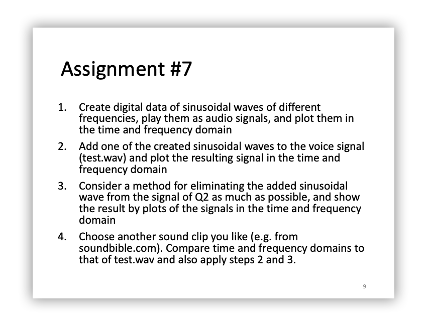 

## Problem 1

In problem 1, we are asked to create digital data of sinusoidal waves with different arbitrary frequencies, play them as audio signals and plot them in the time domain and frequency domain.

First we set the parameters for the waves. For this exercise, I will use the notes A4, A5, A6 and A7 from the ubiquitous 12-tone equal temperament scale. This means the notes are spaced an octave away from each other, or in other words, each one of them is twice the frequency of the note an octave below it. This results in the following frequencies:

<ol>
    <li>A4 = 440 Hz</li>
    <li>A5 = 880 Hz</li>
    <li>A6 = 1760 Hz</li>
    <li>A7 = 3520 Hz</li>
</ol>

And now we can start creating them. To do this, we can use a for loop to iterate through the different frequencies we want the wave to be.

~~~matlab
for i = 0:3
  % All the code snippets in this problem will exist here,
  % unless stated otherwise.
endfor
~~~

Inside this for loop, we can start creating the sinusoidal waves. **Recall that the code snippets for this problem are always inside the `for` loop iterating through `i`, unless stated otherwise.**

~~~matlab
% Frequency of the sine wave we want to create, decides the pitch of the sound.
fsin = 440*2^i;
lineTitle{i+1} = [num2str(fsin) " Hz"]; % Create cell array for legending
T = 1/fsin; % Period of the wave
amplitude = 0.5;% Amplitude of the wave
~~~

With the basic wave properties defined, we then create digital data of the wave by creating "samples", something that needs to be defined for digital audio data. To do this, we select a sample rate and duration, then multiply the two to get the total number of samples. I will choose 44100 Hz, which is not random. 44100 Hz is the most common sample rate used in CD-quality digital audio.

~~~matlab
% Define the sample frequency of the sound
sampleRate = 44100; % Using standard CD quality sample frequency
sampleLength = 1/sampleRate; % Length of time the sample is held for

% Set duration of sound in seconds
duration = 1;

% Total number of samples in the whole duration
samples = round(duration/sampleLength);

sampleSpace = [0:samples-1]; % Creates a space for t to draw from
t = sampleLength*sampleSpace;
~~~

`sampleSpace` is an array with step of 1 and size of `samples`. We have to remember that in computers, time is quantized, or discrete, instead of continuous. Computers have a certain "tick space" where certain events can happen, and nothing can happen between two ticks. This is why we need to define `sampleSpace` as it quantizes time into very small portions (or ticks) of it, so that different events can happen on different ticks inside the space. We need to subtract 1 from `samples` because we are iterating from 0 instead of 1, so to keep the length consistent to the actual number of samples, we need to subtract 1. Then, to synchronize the ticks with our samples, we set `t = sampleLength*sampleSpace;` so that the length of a tick in `sampleSpace` is the same as the length of a single sample. In other words, `t` is an array containing elements `0, sampleLength, 2*sampleLength, 3*sampleLength` and so on, until it reaches the last sample, making `(samples-1)*sampleLength` as the last element in `t`. We set our sample rate at 44100 Hz and duration as 1 second, so this last sample would be the 44100th.

We need to do this so we can assign different values of frequencies to each sample, creating sound when we iterate through the array with the correct sample rate. For this exercise, as we have a sine wave with a set frequency, the frequency assigned to every single sample would be the frequency we assign to that sine wave, but we can imagine a situation where someone is talking, and the different intonation changes will result in different frequencies being recorded. Not to mention there are also overtones and resonance and a lot of different phenomena happening. With a sine wave, everything is very simple, as it only has one constant frequency for its entire duration.

 

<figure>
  
 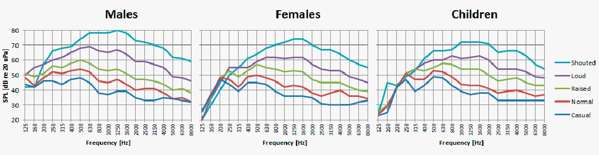 

  <figcaption>Figure 1 - The typical human voice frequency spectrum</figcaption>
  <figcaption>(via <a href = https://www.dpamicrophones.com/mic-university/facts-about-speech-intelligibility>DPA Microphones' article on speech intelligibility</a>)</figcaption>
</figure>

 

Carrying on with our code, we can now define the wave equation for our sine wave. A sinusoidal wave can be defined either using $sin$ or $cos$, as they are both periodic. The general displacement equation can be defined as:

$$ \vec x(t) = \vec A \: sin(\omega t + \phi) $$

We also have $ \omega = 2\pi f$, which means 

$$ \vec x(t) = \vec A \: sin(2\pi f t + \phi) $$

with $\vec x$ as displacement, $\vec A$ as amplitude, $\omega$ as angular frequency, $f$ as frequency and $t$ as time. $\phi$ is phase constant but we can just set that as $0$ here.

~~~matlab
sinWave = amplitude*sin(2*pi*fsin*t); % Define the sine wave
~~~

Finally, we are ready to play the sound of this sin wave. Using `sound()` function,
~~~matlab
sound(sinWave, sampleRate) % Play the sound
~~~

We can also write the sound to a .wav file.
~~~matlab
fileName = [lineTitle{i+1} ".wav"] % Name sound file accordingly
audiowrite(fileName, sinWave, sampleRate) % Create sound file
~~~

And now to plot the wave in the time domain. To do this, we write

~~~matlab
figure(1)
hold on
plot(t,sinWave, 'color', color{i+1}) % Plot in time domain
legend(lineTitle)
xlabel("Time (s)");
ylabel("Amplitude");
~~~

I will explain later what `lineTitle`, `legend` and `color` do in the [Output](#problem-1-output) section. First, we need to realize that compared to our sine wave's period, the duration of the sound is very long. This will result in Octave trying to display a plot covering the whole duration, making the wave very hard to see.

 

<figure>
  
 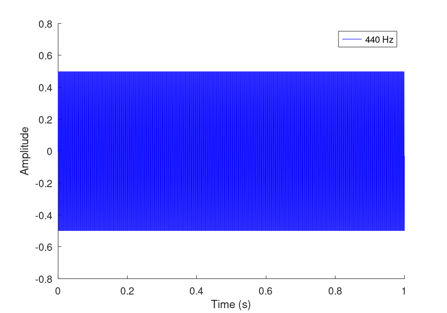 

  <figcaption>Figure 2 - Plot of 440 Hz wave before axis adjustment</figcaption>
</figure>

 

This is why we should adjust the x axis of the plot to only fit one period of our longest wave, which is the 440 Hz, A4 one. To do this, we use the function `axis([x_lo x_hi y_lo y_hi])`, setting `x_lo` to 0, `x_hi` to our longest period `1/440`, and values `-0.55` and `0.55` for `y_lo` and `y_hi` respectively, as we want to see the peaks of our wave. *See the documentation for* `axis()` *<a href='https://docs.octave.org/v8.2.0/Axis-Configuration.html'>here</a>*.

~~~matlab
axis([0 1/440 -0.55 0.55]) % Axis adjustments for time domain
~~~

After the axis adjustments,

 

<figure>
  
 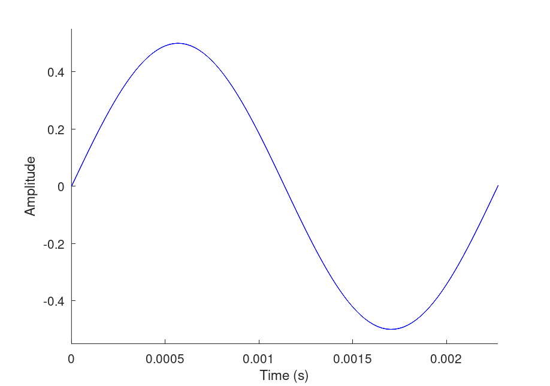 

  <figcaption>Figure 3: Plot of 440 Hz wave after axis adjustment </figcaption>
</figure

 

For plotting the wave in the frequency domain, we need to do Fourier Transform. We can do this using the built-in function `fft`, for Fast Fourier Transform. 

~~~matlab
sinFourier = fft(sinWave); % Apply Fourier transform to our sine wave
sinFourierShift = fftshift(sinFourier); % Shift so 0 frequencies are centered
df = sampleRate / samples; % Create step for xsin array
xsin = -sampleRate/2:df:sampleRate/2-df; % Create domain
~~~

First we apply Fast Fourier Transform to our sine wave. Then we use `fftshift` so that the zero-frequencies are at the center. Next, we define the step for the array for the domain of the plot, and the array itself.

Next we can plot using the defined arrays and values.
~~~matlab
figure(2) % Apply following lines to figure(2) only
hold on
plot(xsin, abs(sinFourierShift), 'color', color{i+1}) % Plot in freq domain
% axis([-4000 4000 -500 13000]) % Uncomment this line to zoom at the spikes
legend(lineTitle)
xlabel("Frequency (Hz)");
ylabel("Samples");
~~~

 

<figure>
  
 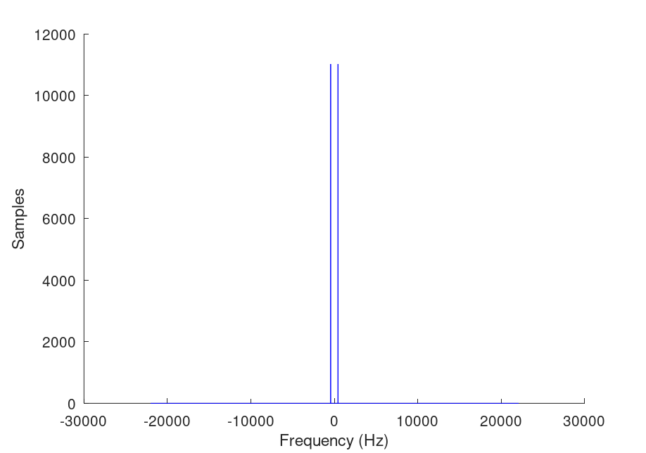 

  <figcaption>Figure 4 - Fourier plot of 440 Hz wave</figcaption>
</figure>

 

As it appears, there are two peaks on out plot, and virtually nothing else. The two peaks also mirror each other. This is because frequencies greater than half of the sample rate cannot be measured uniquely. <a href='https://youtu.be/nOLuVNhBIg0?t=21'>This</a> is an animation explaining why this happens to discrete signals representing continuous signals. Anyway, as it is now, we're not very sure where the peaks are located in the graph. By zooming in though, we can confirm that the peaks are located around the 440 Hz mark, confirming the validity of our code.

 

<figure>
  
 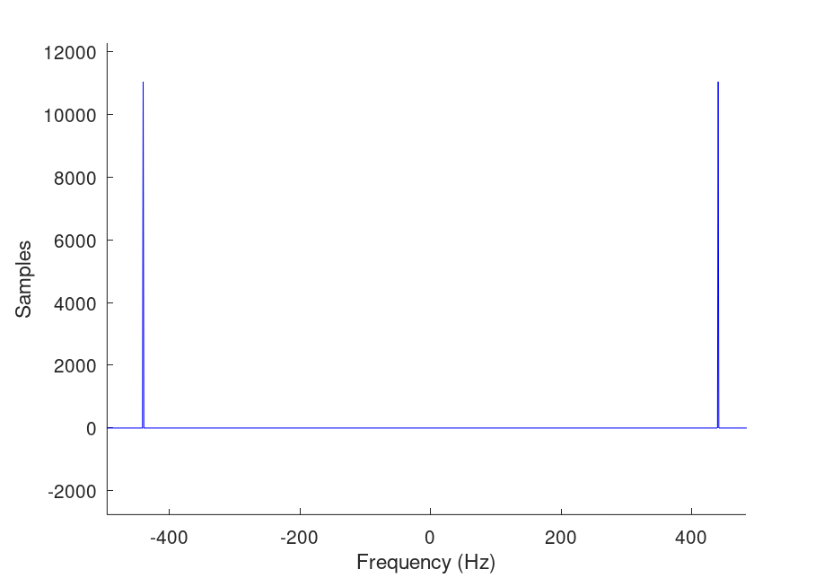 

  <figcaption>Figure 5 - Fourier plot of 440 Hz wave, zoomed in</figcaption>
</figure>

 

### Problem 1 Output

Remember that all the code we just wrote are all nested inside a `for` loop. Therefore we are creating different sounds and plots for the different frequency waves we are iterating through. Running the entirety of the code produces the time plot:

 

<figure>
  
 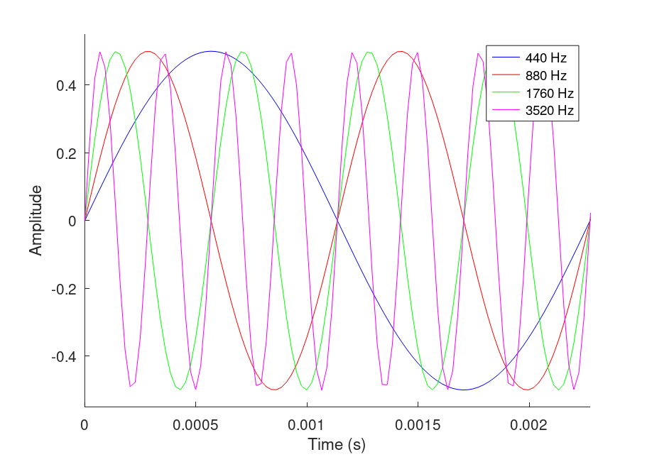 

  <figcaption>Figure 6 - Waves plotted in time domain</figcaption>
</figure>

 

We can clearly see that a single cycle of the blue wave, which is the 440 Hz wave, covers the entirety of our plot domain. This is because we have set the x axis to be as long as the blue wave's period. Our red wave, which is the 880 Hz wave, has two cycles inside the plot window, as it has twice the frequency of the blue wave. This trend continues with the green and magenta wave, each of them twice as frequent as the wave before,  and has twice as many cycles inside the window as the one before.

The other plot window shows the fourier plot:

 

<figure>
  
 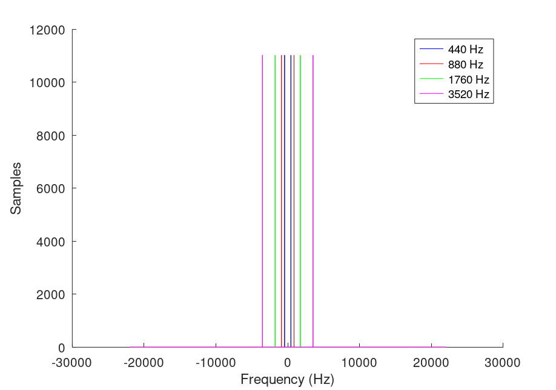 

  <figcaption>Figure 7.1 - Waves plotted in frequency domain</figcaption>
</figure>

 

But this is hard to understand. If we uncomment the `axis()` function, we can zoom in on the frequencies:
~~~matlab
axis([-4000 4000 -500 13000])
~~~

 

<figure>
  
 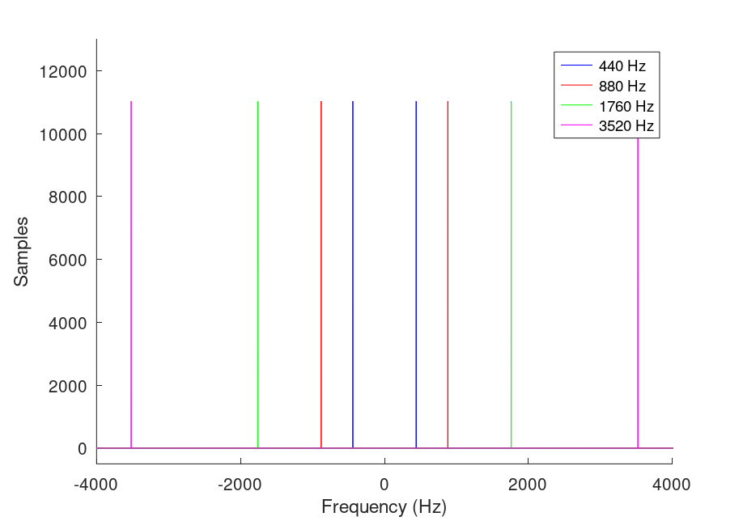 

  <figcaption>Figure 7.2 - Waves plotted in frequency domain, zoomed in</figcaption>
</figure>

 

And now we can see that the spikes are located correctly at their respective frequencies.

When making plots, we use the `figure()` function to have different plot windows. This way we can have two plot windows open at once, one with the time domain and the other with the frequency domain. We also set the `'color'` property to a value previously defined in the script with the array `color`, so we can have different colors according to the variable `i` in the loop. As the `for` loop iterates through `i`, the colors defined for the plot changes, and we get different colored lines for both plots. This way we can identify which lines represent which waves. As for legending, we assign a name for each wave and put them inside a cell array `lineTitle`. We then use this variable inside `legend()` to name different waves accordingly.

*The audio file can be accessed in the support folder <a href='https://drive.google.com/drive/folders/1JGxEE7_QJhW7UCtHKEyVJ_6cJ0E0k5Qq?usp=sharing'>here</a>.*

## Problem 2

Next we are asked to add one of the created sine waves to the audio file and plot the resulting signal with time and frequency domains. This is easy enough, and we can reuse a lot of our code from Problem 1. First we define the sample rate and length of the audio file we want to make:
~~~matlab
% Define the sample frequency of the sound
sampleRate = 44100; % Using standard CD quality sample frequency
sampleLength = 1/sampleRate; % Length of time the sample is held for
~~~

Then we load the audio file test.wav, set the total number of samples equal to its length and create the timespace for the sound:
~~~matlab
% Import audio file
[f,freq] = audioread("test.wav");

% Total number of samples in the whole duration
samples = length(f); % Make length of noise equal to length of audio file

sampleSpace = [0:samples-1]; % Creates a space for t to draw from
t = sampleLength*sampleSpace;
~~~

Next we create a sine wave sound of 440 Hz:
~~~matlab
% Creating noise
fsin = 440; % We choose 440 Hz for noise
amplitude = 0.2; % Amplitude of the wave, this time lowered so we can hear audio

sinWave = amplitude*sin(2*pi*fsin*t); % Define the sine wave
~~~

Then combine the two:
~~~matlab
% Add noise to audiofile
noisy = f + sinWave';
~~~

To plot in the time domain, we just use the same timespace but now with frequencies in the newly defined `noisy`:
~~~matlab
% Plot the resulting sound with time domain
figure(1)
plot(t, noisy) % Plot noisy sound
title("Time domain plot of noisy audio file");
xlabel("Time (s)");
ylabel("Amplitude");
~~~

For Fourier transformation, we can reuse code but change it to transform `noisy` instead of `sinWave`:
~~~matlab
noisyFourier = fft(noisy); % Apply Fourier transform to our noisy sound
noisyFourierShift = fftshift(noisyFourier); % Shift so 0 frequencies are centered
df = sampleRate / samples; % Create step for xsin array
xdomain = -sampleRate/2:df:sampleRate/2-df; % Create domain
~~~

Then for the Fourier plot:
~~~matlab
figure(2) % Apply following lines to figure(2) only
plot(xdomain, abs(noisyFourierShift)) % Plot in freq domain
title("Fourier plot of noisy audio file")
xlabel("Frequency (Hz)");
ylabel("Samples");
~~~

To play the sound and write a .wav file for it:
~~~matlab
sound(noisy, sampleRate) % Play the sound
audiowrite("noisy.wav", noisy, sampleRate) % Create sound file
~~~

### Problem 2 Output
The time domain plot looks like this:

 

<figure>
  
 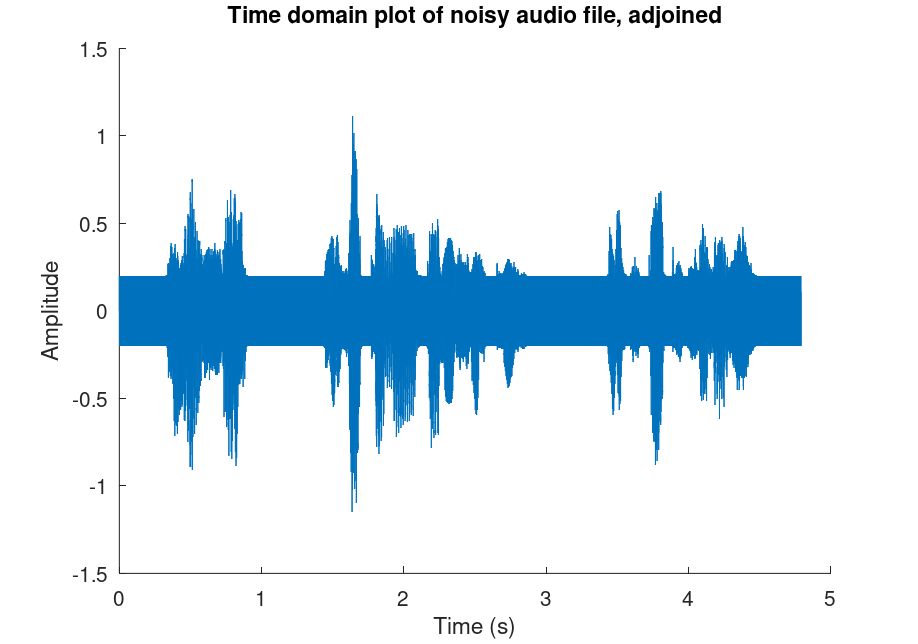 

  <figcaption>Figure 8 - Time plot of noisy signal</figcaption>
</figure>

 

We can see that there is a noticeable bar of sound with constant amplitude across the whole duration, overlapping with the voice audio.

The Fourier plot looks like this:

 

<figure>
  
 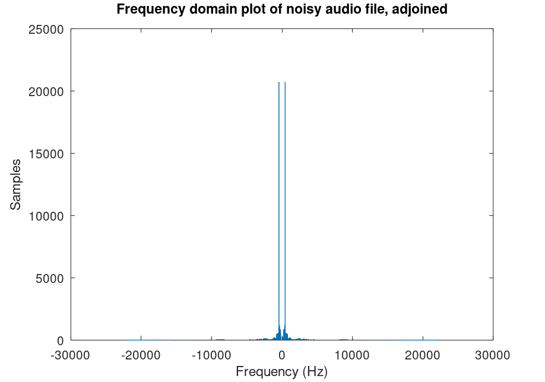 

  <figcaption>Figure 9 - Fourier plot of noisy signal</figcaption>
</figure>

 

And in the fourier plot we see two peaks of the same frequency with many samples, as we have the sine wave playing throughout the entire file.

We can observe better by plotting the different components of the signal separately but on a single plot window:
~~~matlab
figure(1)
title("Time domain plot of noisy audio file, separated")
hold on
plot(t, sinWave, "r") % Plot sin wave
plot(t, f, "b")
xlabel("Time (s)");
ylabel("Amplitude");
~~~
and for Fourier plot, we have to separately transform both signals then plot them:
~~~matlab
% For Fourier plot:
sinFourier = fft(sinWave); % Apply Fourier transform to our sine wave
sinFourierShift = fftshift(sinFourier); % Shift so 0 frequencies are centered
df = sampleRate / samples; % Create step for xsin array
xsin = -sampleRate/2:df:sampleRate/2-df; % Create domain

F = fft(f); % Fourier transform the audio file
Fshift = fftshift(F); % Shift so 0 frequencies are centered
df = freq / length(F); % Create step for x1 array
x1 = -freq/2:df:freq/2-df; % Create frequency domain

figure(2) % Apply following lines to figure(2) only
hold on
plot(xsin, abs(sinFourierShift),"r") % Plot sin wave
title("Frequency domain plot of noisy audio file, separated")
plot(x1, abs(Fshift), "b") % Plot in freq domain
xlabel("Frequency (Hz)");
ylabel("Samples");
~~~

 

<figure>
  
 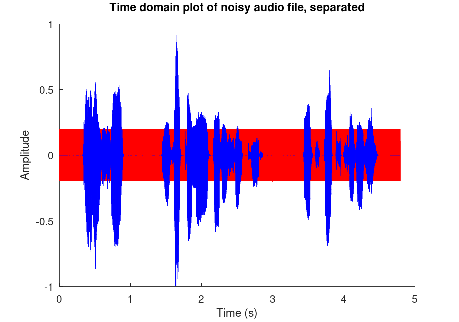 

  <figcaption>Figure 10 - Time plot of noisy signal, separated</figcaption>
</figure>

 

<figure>
  
 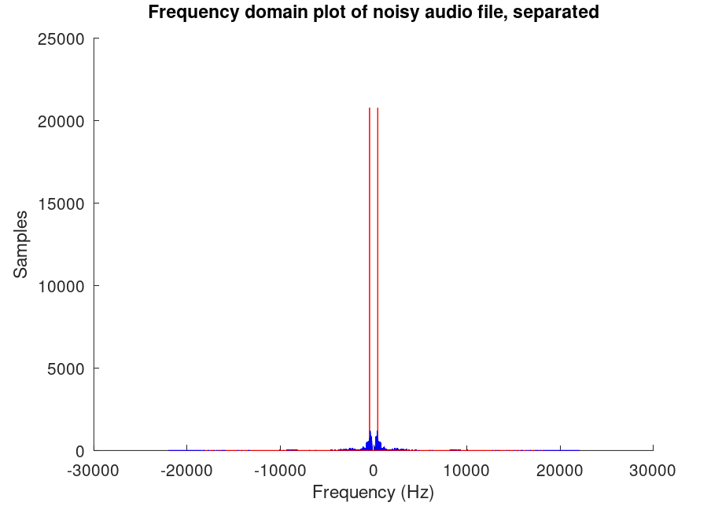 

  <figcaption>Figure 11 - Fourier plot of noisy signal, separated</figcaption>
</figure>

 

We can see clearly that the twin peaks are red, indicating that it is our noise signal.

*The audio file can be accessed in the support folder <a href='https://drive.google.com/drive/folders/1JGxEE7_QJhW7UCtHKEyVJ_6cJ0E0k5Qq?usp=sharing'>here</a>.*

## Problem 3

To eliminate the noise from our noisy audio, we can try to eliminate the specific frequency where our noise is at. In fact, this technique is used in audio production and manipulation. In Digital Audio Workstation software like Ableton Live, Logic Pro, FL Studio, and more come with spectrum analyzers, graphic equalizers and sometimes combinations of both to let producers see the frequency spectrum of an audio file and modify the spectrum as they please. This lets them take out certain frequencies in the audio file. For example, I use Ableton Live's built-in graphic equalizer to edit audio files of drums and guitar recordings, which allow me to take out unwanted high frequencies coming from cymbals which can cause fatigue when heard for a long time, or unwanted muddy middle frequencies around 100 Hz in guitar recordings that makes the sound fuzzy and lose clarity.

To apply this principle in Octave, first we carry over the code from Problem 2 to get the noisy signal. Then we specify a frequency range where we want to take out frequency components from.

~~~matlab
% Remove noise
filterOut = abs(xdomain) > 430 & abs(xdomain) < 450; % Select frequencies between 430 Hz and 450 Hz
keepFrequencies = ~filterOut;
~~~

We define `filterOut` as the frequencies we want to take out, and using the NOT logical operator `~` we flip it so that the values we want to take out become 0 and the values we want to keep become 1.

We also plot the logical gate to see where we will be cutting out frequency components from.
~~~matlab
% Plot the logical filtering gate
figure(3)
plot(xdomain, keepFrequencies)
title("Fourier plot of the logical gate for the filtering. 1 means the frequency components are kept")
xlabel("Frequency (Hz)")
axis([-600 600 -0.5 1.5])
~~~

Now comes the time to actually take out the frequency components.
~~~matlab
% Cancel noise frequencies according to defined filter
noiseCancelled = ifft(ifftshift(noisyFourierShift.*keepFrequencies'));
~~~

By doing this, we essentially are multiplying the values in `noisyFourierShift` to the logical gate array `keepFrequencies`, which we first have to transpose because it is not a row vector. This will leave alone frequency components not targeted by the logical gate, as we multiply it by one. However, the range between 430 and 450 Hz, which we have set earlier, have values of `0` in the logical gate. This when multiplied with the corresponding frequency component, results in 0, effectively deleting it from our audio file.

Then we plot the resulting noise cancelled signal in both time and frequency domains, reusing code from other plots and changing accordingly.
~~~matlab
% Plot the noise cancelled signal in time domain
figure(4)
plot(t, noiseCancelled);
title("Time domain plot for noise cancelled signal");
xlabel("Time (s)");
ylabel("Amplitude");

% Plot the noise cancelled signal in frequency domain
figure(5)
noiseCancelledFourier = fft(noiseCancelled); % Apply Fourier transform to our noise cancelled sound
noiseCancelledFourierShift = fftshift(noiseCancelledFourier); % Shift so 0 frequencies are centered
plot(xdomain, abs(noiseCancelledFourierShift));
title("Fourier plot of noise cancelled audio file");
xlabel("Frequency (Hz)");
ylabel("Samples");
~~~

 

<figure>
  
 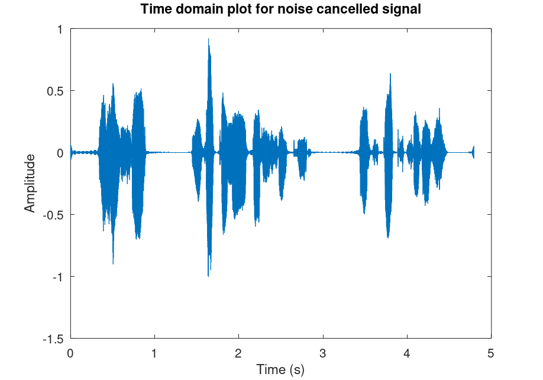 

  <figcaption>Figure 12 - Time plot of noise cancelled audio file</figcaption>
</figure>

 

<figure>
  
 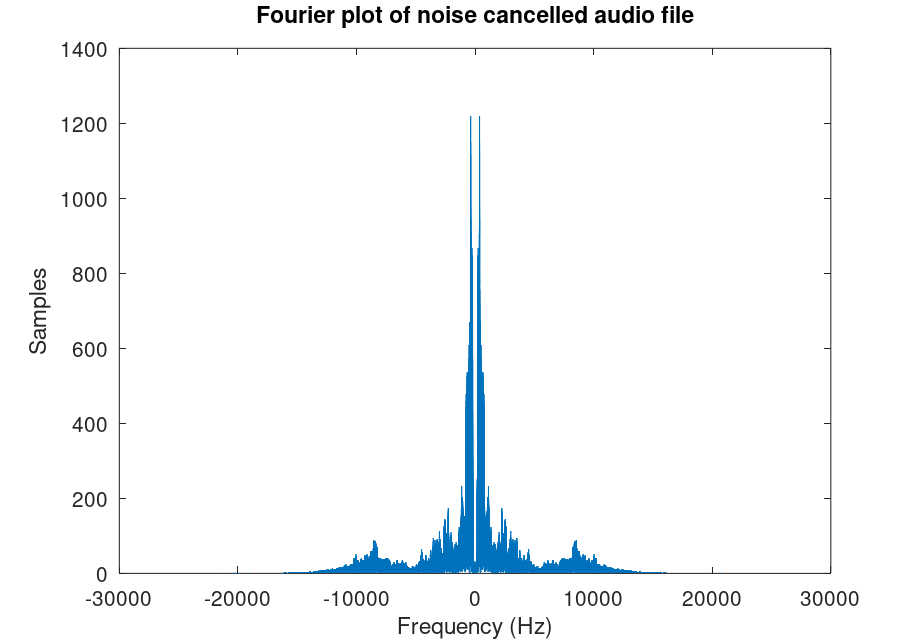 

  <figcaption>Figure 13.1 - Fourier plot of noise cancelled audio file</figcaption>
</figure>

 

Zooming in around the 440 Hz part of our Fourier plot, we can see that there is a box-shaped valley in the frequency response, because we've taken out that part of the signal.

 

<figure>
  
 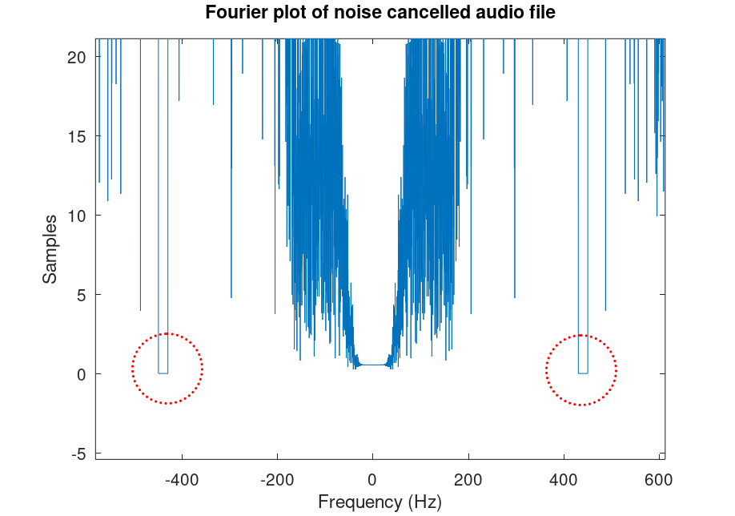 

  <figcaption>Figure 13.2 - Fourier plot of noise cancelled audio file, zoomed in</figcaption>
</figure>

 

Lastly we can play the processed signal with `sound()`.
~~~matlab
% Play the noise cancelled signal
sound(noiseCancelled, sampleRate);

% Save it to a .wav file
audiowrite("noisecancelled.wav", noiseCancelled, sampleRate);
~~~

*The audio file can be accessed in the support folder <a href='https://drive.google.com/drive/folders/1JGxEE7_QJhW7UCtHKEyVJ_6cJ0E0k5Qq?usp=sharing'>here</a>.*

## Problem 4

 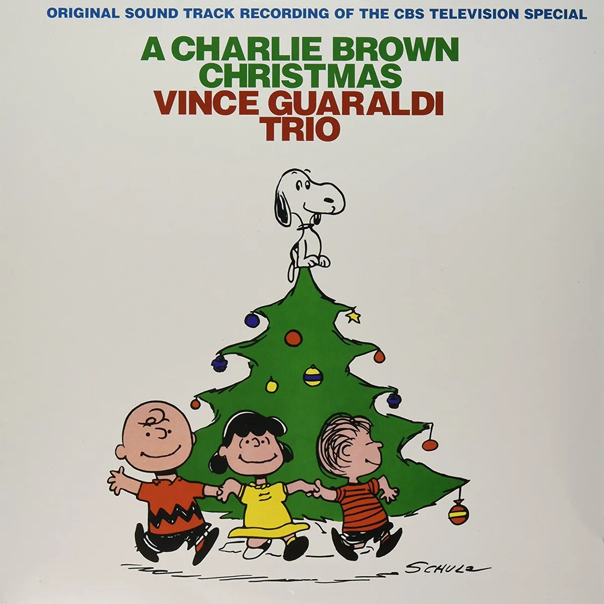 

For this last problem, we will use a 29 second clip of myself playing "O Tannenbaum" by The Vince Guaraldi Trio on piano, because a fairly realistic application for this technique is music production. This problem uses basically all of the code from our last problem, we just change the file loaded by the script to `"tannenbaum.wav"`.
~~~matlab
[f,freq] = audioread("tannenbaum.wav");
~~~

Then plotting the sound with the time and frequency domains:

~~~matlab
% Plot the audio file with time domain
figure(1)
plot(t, f, 'g')
title("Time domain plot of tannenbaum audio file");
xlabel("Time (s)");
ylabel("Amplitude");

tannenbaumFourier = fft(f); % Apply Fourier transform to our tannenbaum file
tannenbaumFourierShift = fftshift(tannenbaumFourier); % Shift to center 0 freqs
df = sampleRate / samples; % Create step for xsin array
xdomain = -sampleRate/2:df:sampleRate/2-df; % Create domain

figure(2) % Apply following lines to figure(2) only
plot(xdomain, abs(tannenbaumFourierShift), 'g') % Plot in freq domain
title("Fourier plot of tannenbaum audio file")
axis([-5000 5000 -500 15000]);
xlabel("Frequency (Hz)");
ylabel("Samples");

% Play original audio file
printf("Currently Playing Original Audio File\n")
sound(f, sampleRate)
~~~

Which outputs the following plots:

 

<figure>
  
 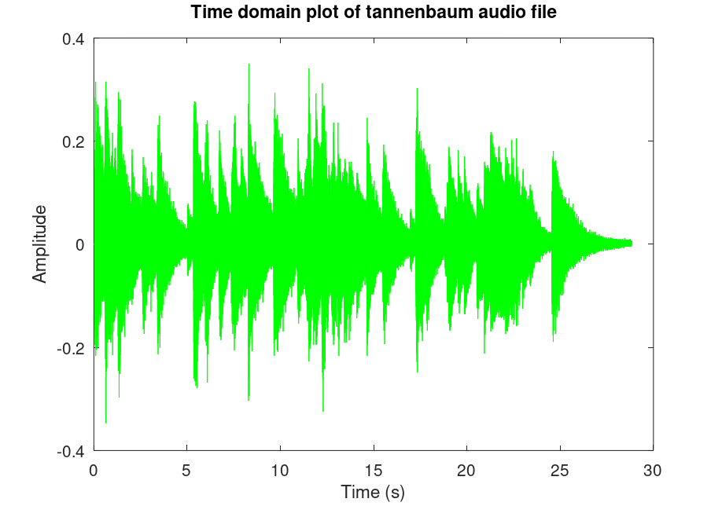 

  <figcaption>Figure 14 - Time domain plot of tannenbaum.wav (how fitting, it loooks like a Christmas tree sideways.)</figcaption>
</figure>

 

<figure>
  
 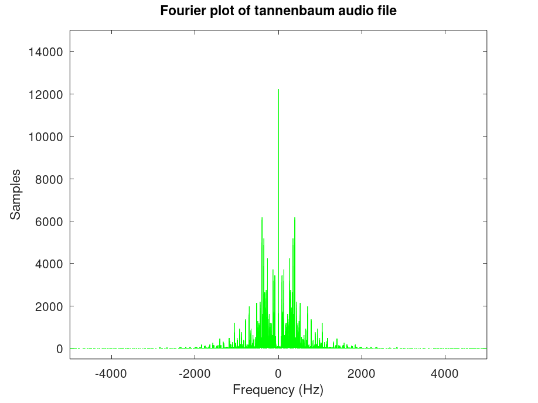 

  <figcaption>Figure 15 - Fourier plot of tannenbaum.wav</figcaption>
</figure>

 

Compared to test.wav, tannenbaum.wav has more discrete frequency variation. We can see this by observing the "jaggedness" of the Fourier plot. This is because the notes on a piano, like our sine wave, has a constant frequency. When I press the F note and hold it down, it will stay at a constant frequency until I let go of it. This is why unlike the Fourier plot of test.wav, this Fourier plot looks like a collection of very thin bars instead of semi-smooth hills and valleys. Other than that, we can also see in the time domain plot that tannenbaum.wav file has slower decay rate than test.wav. Decay is a term used in music production and audio engineering which basically means the fade out of a sound. A sound with a long decay means it fades out over a long time. A fast decay means the sound barely has any linger, or it disappears almost immediately after the main part of the sound. The human voice doesn't have much decay, and that's why we don't see many gradual hills following peaks in the time plot of test.wav. In tannenbaum.wav though, I am playing a piano with a foot pedal. I have set the electronic piano to have a slight decay when I release the keys but still have my foot on the pedal, which means every time I release my hand from the keys, there is still a bit of sound being recorded, just fading out slowly. Things like attack and decay are what we can see this with the time plot, while frequency response we can see with the Fourier plot.

Now to execute the steps of problem 2:
~~~matlab
% Creating noise
fsin = 440; % We choose 440 Hz for noise
amplitude = 0.2; % Amplitude of the wave, this time lowered so we can hear audio

sinWave = amplitude*sin(2*pi*fsin*t); % Define the sine wave

% Add noise to audiofile
noisy = f + sinWave';

% Plot the resulting sound with time domain
figure(1)
plot(t, noisy, 'g') % Plot noisy sound
title("Time domain plot of noisy audio file");
xlabel("Time (s)");
ylabel("Amplitude");

noisyFourier = fft(noisy); % Apply Fourier transform to our noisy sound
noisyFourierShift = fftshift(noisyFourier); % Shift so 0 frequencies are centered
df = sampleRate / samples; % Create step for xsin array
xdomain = -sampleRate/2:df:sampleRate/2-df; % Create domain

figure(2) % Apply following lines to figure(2) only
plot(xdomain, abs(noisyFourierShift), 'g') % Plot in freq domain
title("Fourier plot of noisy audio file")
xlabel("Frequency (Hz)");
ylabel("Samples");

% Play the noisy audio file
clc
printf("Currently Playing Noisy Audio File\n")
sound(noisy, sampleRate)
audiowrite("noisy-tannenbaum.wav", noisy, sampleRate)
~~~

As the file tannenbaum.wav is a relatively lower volume file, the noise has a significant effect on the audibility of the piano. The noise cancelling algorithm will be a perfect solution to this real problem.

 

<figure>
  
 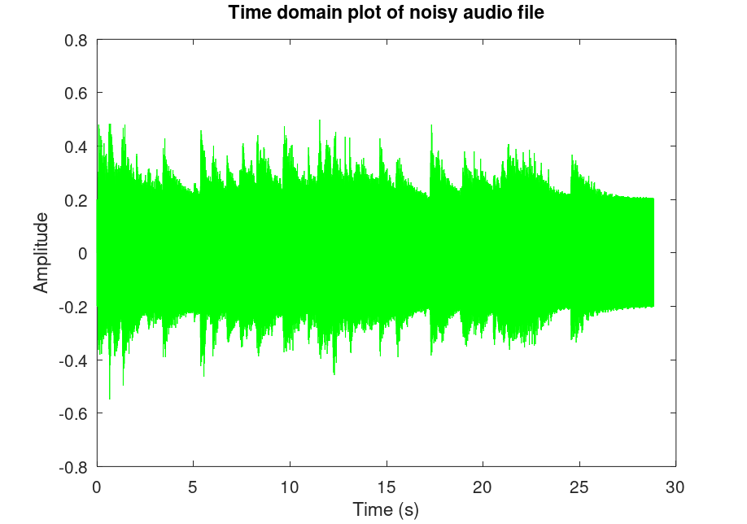 

  <figcaption>Figure 16 - Time domain plot of noisytannenbaum.wav</figcaption>
</figure>

 

<figure>
  
 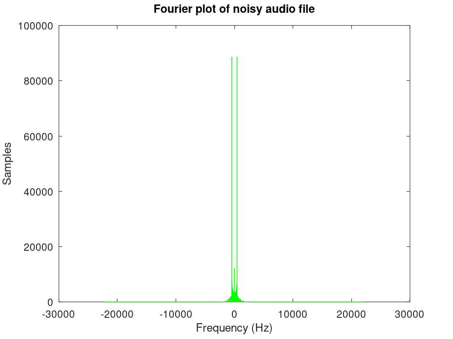 

  <figcaption>Figure 17 - Fourier plot of noisytannenbaum.wav</figcaption>
</figure>

 

Applying the steps of problem 3,

~~~matlab
% Remove noise
filterOut = abs(xdomain) > 400 & abs(xdomain) < 450; % Select frequencies to del
keepFrequencies = ~filterOut;

% Plot the logical filtering gate
figure(3)
plot(xdomain, keepFrequencies)
title("Fourier plot of the logical gate for the filtering. 1 means the frequency components are kept")
xlabel("Frequency (Hz)")
axis([-600 600 -0.5 1.5])

% Cancel noise frequencies according to defined filter
noiseCancelled = ifft(ifftshift(noisyFourierShift.*keepFrequencies'));

% Plot the noise cancelled signal in time domain
figure(4)
plot(t, noiseCancelled, 'c');
title("Time domain plot for noise cancelled signal");
xlabel("Time (s)");
ylabel("Amplitude");

% Plot the noise cancelled signal in frequency domain
figure(5)
noiseCancelledFourier = fft(noiseCancelled); % Apply Fourier transform
noiseCancelledFourierShift = fftshift(noiseCancelledFourier);
plot(xdomain, abs(noiseCancelledFourierShift), 'c');
title("Fourier plot of noise cancelled audio file");
axis([-5000 5000 -500 15000]);
xlabel("Frequency (Hz)");
ylabel("Samples");

% Play the noise cancelled signal
clc
printf("Currently Playing Noise Cancelled Audio File\n")
sound(noiseCancelled, sampleRate);

% Save it to a .wav file
audiowrite("tannenbaum-noisecancelled.wav", noiseCancelled, sampleRate);
~~~

We get the noise cancelled plots:

 

<figure>
  
 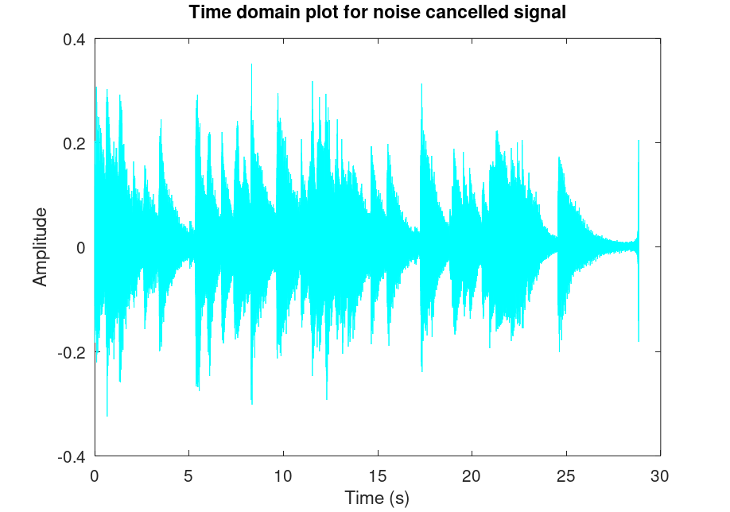 

  <figcaption>Figure 18 - Time domain plot of tannenbaum-noisecancelled.wav</figcaption>
</figure>

 

<figure>
  
 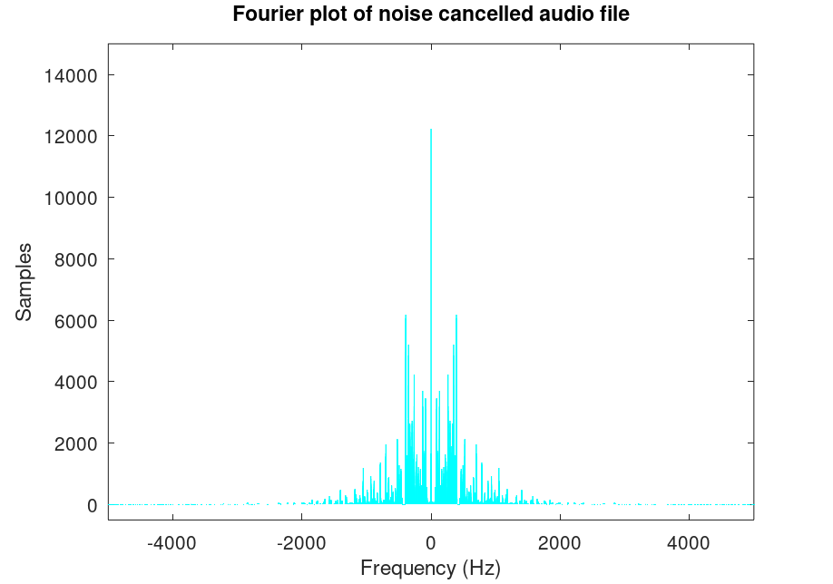 

  <figcaption>Figure 19 - Fourier plot of tannenbaum-noisecancelled.wav</figcaption>
</figure>

 

Even though the noise effected the signal significantly, after noise cancelling, there is virtually no difference to the original file, and this is confirmed by the time and fourier plots. This is why the Fourier Transform was a great contribution to signal processing, as it made things like noise-cancelling headphones and signal jammers possible.

*All audio files and other supporting files can be accessed in the support folder <a href='https://drive.google.com/drive/folders/1JGxEE7_QJhW7UCtHKEyVJ_6cJ0E0k5Qq?usp=sharing'>here</a>.*

[comment]: <> (Below is CSS code for the output HTML and pdf files. Don't touch them unless you know what you're doing.)

