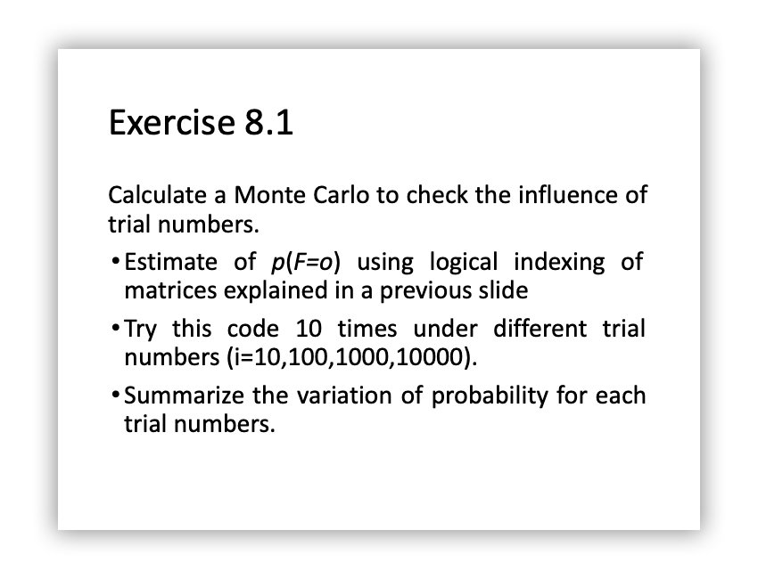
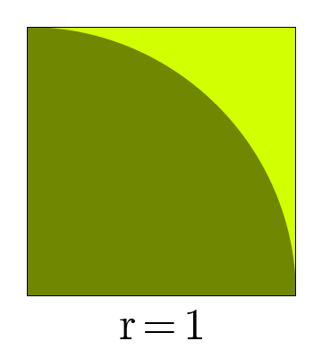
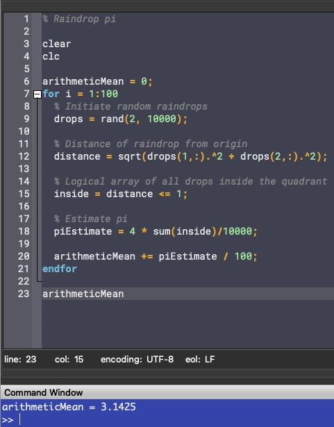
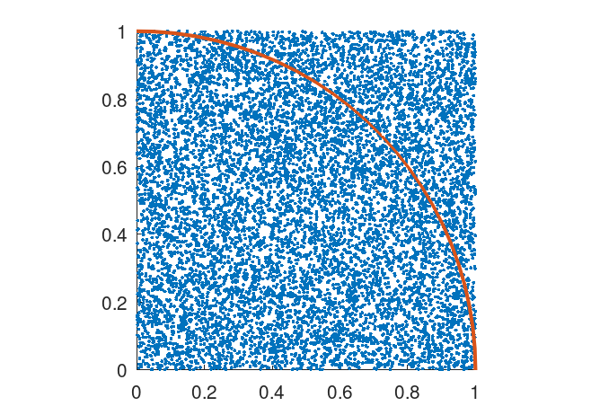
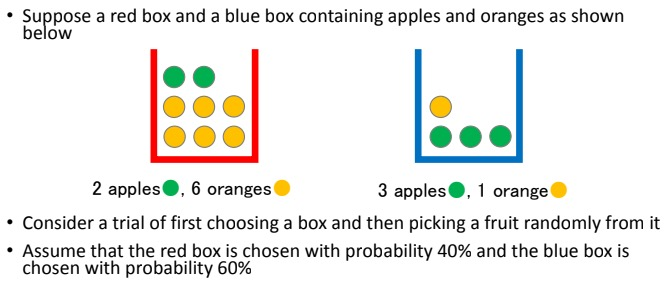
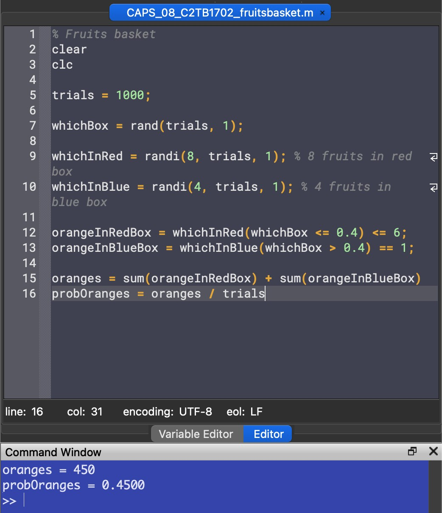
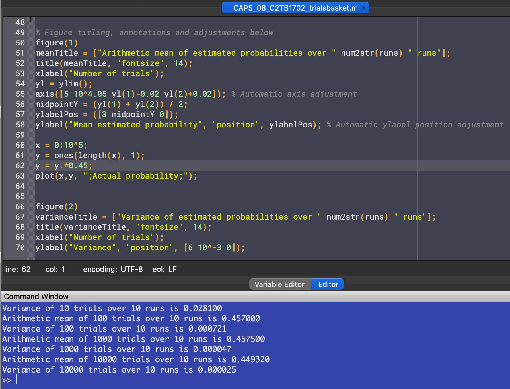
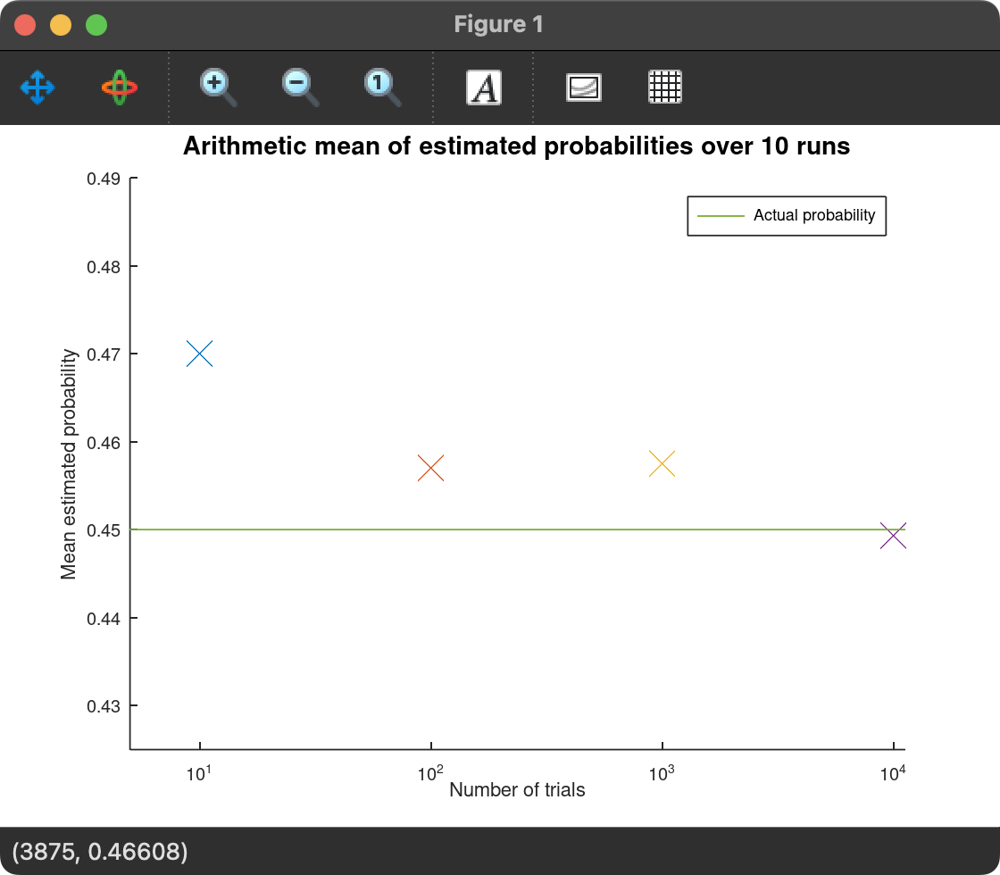
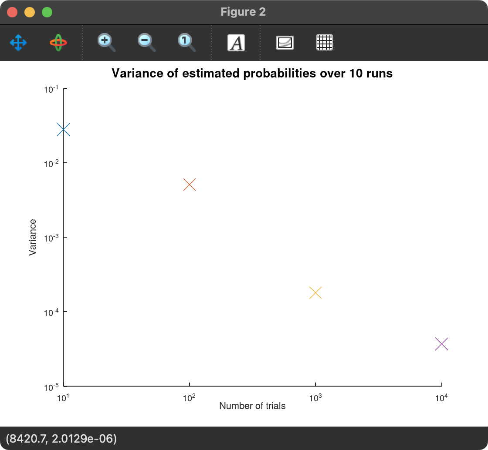

# Report 8
Maximilian Fernaldy - C2TB1702

  

## Introduction to the Monte Carlo method
Monte Carlo sampling or Monte Carlo simulation is a method of simulating random events to examine quantities that are deterministic in nature. By simulating events and examining occurrences, with a large enough sample, a comfortably close estimate can be obtained for quantities that are deterministic, but difficult or not possible to obtain the exact value of.

### An example
Say we don't have access to all other approaches of approximating $\pi$. Imagine a unit square with sides of length $1$, and a quadrant (one-fourth of a circle) with radius $r = 1$ inside it.

<figure>
  
  

  <figcaption>Figure 1 - Unit square with a quadrant inside it</figcaption>
</figure>

The area of the quadrant is $\frac{1}{4}$ the area of a circle with the same radius:

$$ A_{unit\:quadrant} = \frac{1}{4} A_{unit\:circle} = \frac{1}{4} \pi r^2 = \dfrac{\pi}{4} $$

The area of a unit square, of course, is just $1^2 = 1$. This means the ratio of their areas are:

$$ \dfrac{A_{quadrant}}{A_{square}} = \dfrac{\frac{\pi}{4}}{1} = \dfrac{\pi}{4}$$

Now if we assume "rain" falls on this diagram, and the hypothetical raindrops have uniform scattering, we can count the number of raindrops inside the circle and the total number of raindrops that fell, which will allow us to obtain the ratio of the two areas.

### Estimating pi with the Monte Carlo method in Octave (raindrops.m)

~~~matlab
% Initiate random raindrops
drops = rand(2, 10000);

% Distance of raindrop from origin
distance = sqrt(drops(1,:).^2 + drops(2,:).^2);

% Logical array of all drops inside the quadrant
inside = distance <= 1;

% Estimate pi
pi = 4 * sum(inside)/10000
~~~

First we initiate a $2 \times N$ array, with N representing the number of raindrops we want. We fill this array with random values between $0$ and $1$, where the first row represents the $x$-position of the drop and the second represents the $y$-position. To determine the distance from the origin, we can use Pythagoras' Theorem:

$$ d^2 = x^2 + y^2 \quad \Rightarrow \quad |d| = |\sqrt{x^2 + y^2}| $$

With logical array indexing, we can select all the elements in `distance` that is less than 1, or in other words, raindrops within the quadrant, and use that to make a logical array (0s and 1s) named `inside`. Summing this array gives us the total amount of raindrops inside the quadrant, and dividing it by 10000 gives us the approximation of the ratio of areas of the quadrant and the square. Multiplying this ratio by 4 will give us the approximated value of $\pi$, as explained earlier.

Putting the code inside a `for` loop and taking the arithmetic mean of 100 runs, we get a fairly accurate approximation of it:

<figure>
  
  

  <figcaption>Figure 2 - Approximation of π with Monte Carlo method</figcaption>
</figure>

 

<figure>
  
  

  <figcaption>Figure 3 - Dropping metaphorical raindrops to estimate π (N = 10000)</figcaption>
</figure>

## The fruits basket problem (fruitsbasket.m)

  

We are asked to estimate $p(F=o)$ by using the Monte Carlo method. First we have to realize that this problem has multiple stages. First we randomly choose a box, then we randomly choose a fruit. Both of these levels have different probabilities for different events as well. As we know the probability of each box being chosen and the composition of fruits in each box, we can use the Monte Carlo method to estimate the probability of getting an orange.

### Solving the fruits basket problem manually using probability theory

We know that the probability of choosing the red box is 40%, and the probability of choosing the blue box is 60%. We can denote this by

$$ p(B = r) = 0.4 \quad and \quad p(B = b) = 0.6 $$

Next, there are 2 apples and 6 oranges with total 8 fruits in box red, and 3 apples and 1 orange with total 4 fruits in box blue. We can denote this by

$$ p(F = o|B = r) = \frac{6}{8} = \frac{3}{4} $$

$$ p(F = o|B = b) = \frac{1}{4} $$

With probability theory,

$$ \begin{aligned} p(F = o, B = r) &= p(F = o|B = r) \times p(B = r) \\ &= \dfrac{3}{4} \times 0.4 \\ &= 0.3 \end{aligned} $$

$$ \begin{aligned} p(F = o, B = b) &= p(F = o|B = b) \times p(B = b) \\ &= \dfrac{1}{4} \times 0.6 \\ &= 0.15 \end{aligned} $$

$$ \begin{aligned} p(F = o) &= p(F = o, B = r) + p(F = o, B = b) \\ &= 0.3 + 0.15 \\ &= 0.45 \end{aligned} $$

So the probability of getting an orange when picking a fruit from the two boxes is 45%.

### Solving the fruits basket problem using the Monte Carlo problem

Suppose we don't have access to established probability theory, and all we can do is just repeatedly, randomly pick out fruits from the box and tally the results. Using Octave, we can simulate this situation.

~~~matlab
trials = 1000;
~~~

First, we initiate the number of trials we want. Let's do 1000 trials for now and assign it to the variable `trials`.

~~~matlab
whichBox = rand(trials, 1);
~~~

Then for randomizing which box we pick, we use the function `rand` and set the array size to `trials`.

~~~matlab
whichInRed = randi(8, trials, 1); % 8 fruits in red box
whichInBlue = randi(4, trials, 1); % 4 fruits in blue box
~~~

To randomize which fruit we pick when a box is already chosen, we use the function `randi` which is just like `rand` but outputs integers starting from 1 instead. We set the maximum according to the number of fruits in each box: 8 in the red box and 4 in the blue box.

~~~matlab
orangeInRedBox = whichInRed(whichBox <= 0.4) <= 6;
orangeInBlueBox = whichInBlue(whichBox > 0.4) == 1;
~~~

Now we use logical array indexing:
1. First, we create a logical array and assign values to it depending on whether or not the logical expression on the right of the equal sign is true or false. 
2. Then to define the event of the red box being picked, we select variables in the random array `whichBox` lower than or equal to $0.4$. This means the probability to get a `1` is $40\%$. Conversely we assign the event of the blue box being picked to variables in `whichBox` being larger than $0.4$, resulting in a $60%$ chance of it being chosen.
3. For the final level of the indexing, we select the events where an orange is picked. In the red box, there are 6 oranges, so we select events where the random integer is lower than or equal to 6. In the blue box, there is only one, so we select events where the random integer equals 1.

We would then have the arrays of occurrences for two possible events: picking an orange from the red box and picking an orange from the blue box. If we sum up the arrays, we will know how many times these events happened. In our earlier notation,

`sum(orangeInRedBox)` = $ n(F = o, B = r) $
`sum(orangeInBlueBox)` = $ n(F = o, B = b) $

The number of times we get an orange is the sum of these two:
~~~matlab
oranges = sum(orangeInRedBox) + sum(orangeInBlueBox)
~~~

Finally, to get the probability of getting an orange, we divide the number of times we get an orange by the total number of trials.
~~~matlab
probOranges = oranges / trials
~~~

### Output

<figure>
  
  

  <figcaption>Figure 4 - Output of fruitsbasket.m</figcaption>
</figure>

The program outputs probability values somewhere between `0.4` and `0.5`. We have to remember that this number is just an estimate, as it essentially brute forces the problem by attempting it many times. Note that although the screenshot above outputs exactly `0.4500` as the probability, this is just a coincidence and running the code again will most lilkely result in a different value.

### The influence of trial numbers on the Monte Carlo method (trialsbasket.m)

Putting the code from the previous section inside a loop of 10 runs and iterating through trial numbers `trials = 10^i`, we can vary the trial numbers and take the mean and variance of the estimated probabilities over 10 runs:
~~~matlab
runs = 10;

for i = 1:4 % Iterate through 10^i number of trials
  trials = 10^i;

  for j = 1:runs % The code inside this loop runs 10 times

    whichBox = rand(trials, 1); % Randomize which box is picked

    whichInRed = randi(8, trials, 1); % 8 fruits in red box
    whichInBlue = randi(4, trials, 1); % 4 fruits in blue box

    orangeInRedBox = whichInRed(whichBox <= 0.4) <= 6; % 6 oranges in red box
    orangeInBlueBox = whichInBlue(whichBox > 0.4) == 1; % 1 orange in blue box

    oranges = sum(orangeInRedBox) + sum(orangeInBlueBox);
    probOranges(j) = oranges / trials; % Put estimated probabilities in an array
  endfor

  % Mean of the estimated probability over 10 runs
  meanProb = sum(probOranges) / runs;
  printf("Arithmetic mean of %d trials over %d runs is %f\n", trials, runs, meanProb)

  varianceNumerator = 0;
  for k = 1:runs % Get sum of squared differences
    varianceNumerator += (probOranges(k) - meanProb)^2;
  endfor

  % Variance of the estimated probability over 10 runs
  variance = varianceNumerator / runs;
  printf("Variance of %d trials over %d runs is %f\n", trials, runs, variance)

  % Plot mean probability
  figure(1)
  semilogx(trials, meanProb, "x", "markersize", 8)

  % Plot variance
  figure(2)
  loglog(trials, variance, "x", "markersize", 8)

endfor
~~~

Let's go through the code one section at a time.

The arithmetic mean is taken by summing up the estimated probabilities that we have stored in the array `probOranges` and dividing it by the number of runs, which is 10 in this case.
~~~matlab
% Mean of the estimated probability over 10 runs
meanProb = sum(probOranges) / runs;
printf("Arithmetic mean of %d trials over %d runs is %f\n", trials, runs, meanProb)
~~~

To get the variance of the different estimates over the 10 runs, we need to sum up the squared difference of each estimate and the mean.

$$ \sigma^2 = \frac{\displaystyle\sum_{i=1}^{N} (x_i - \bar{x})^2}{N} $$

In our variable naming convention, the formula for variance becomes:

$$ variance = \frac{\displaystyle\sum_{k=1}^{runs}(probOranges_k - \overline{probOranges})^2}{runs} $$

where $runs$ is the total number of runs we do for each trial number, $probOranges_k$ is the $k^{th}$ estimated probability and $\overline{probOranges}$ is the arithmetic mean of the probabilities. To do this in Octave, we can get the numerator part of the formula by iterating through the 10 runs and getting the squared differences of each element of `probOranges` and the mean of `probOranges`:
~~~matlab
varianceNumerator = 0;
for k = 1:runs % Get sum of squared differences
  varianceNumerator += (probOranges(k) - meanProb)^2;
endfor
~~~

then divide `varianceNumerator` by `runs` to get `variance`:
~~~matlab
% Variance of the estimated probability over 10 runs
variance = varianceNumerator / runs;
printf("Variance of %d trials over %d runs is %f\n", trials, runs, variance)
~~~

### Output and Discussion

<figure>
  
  

  <figcaption>Figure 5 - Output of trialsbasket.m</figcaption>
</figure>

Just by running the Monte Carlo estimation over and over, we can infer that as the number of trials increases, the more consistent the estimated probability is. However, by running it inside a for loop and taking the mean and variance of these estimated probabilities, we can more confidently confirm that as the number of trials increases, the less variance there is in the estimated probabilities. In data science, less variance is associated with closer data points to the arithmetic mean. In plain English, the estimated probabilities when running a 10,000-trials Monte Carlo simulation is significantly closer to the actual probability than, say, a 10-trials Monte Carlo simulation.

To show this visually, we can even plot the different mean and variance values on logarithmic-scaled axes:
~~~matlab
% Plot mean probability
figure(1)
semilogx(trials, meanProb, "x", "markersize", 8)

% Plot variance
figure(2)
loglog(trials, variance, "x", "markersize", 8)
~~~

Which outputs these two plots:

<figure>
  
  

  <figcaption>Figure 5 - Plot of mean estimated probability</figcaption>
</figure>

 

<figure>
  
  

  <figcaption>Figure 6 - Plot of variance of the probabilities</figcaption>
</figure>

 

From these plots, we can see that as the number of trials increases, the estimate closest to the actual probability is more often than not the one with the most trials. This is **not** a certainty though. As there is randomness associated with the method, sometimes less trials can be closer to the actual probability. However, more trials result in more consistent estimates. This is shown by the downward-trending variance, which means the estimated probabilities are more consistent and less erratic.

## Conclusion

It can be concluded that with the Monte Carlo method, more trials will result in a more consistent estimated probability when ran multiple times. When ran just once, higher trial numbers tend to be closer to the actual theoretical value, but as the Monte Carlo method relies on randomness, it is ultimately possible that lower trial numbers might result in a closer value to the theoretical one, it's just not very likely.

 
 

[comment]: <> (Below is CSS code for the output HTML and pdf files. Don't touch them unless you know what you're doing.)

