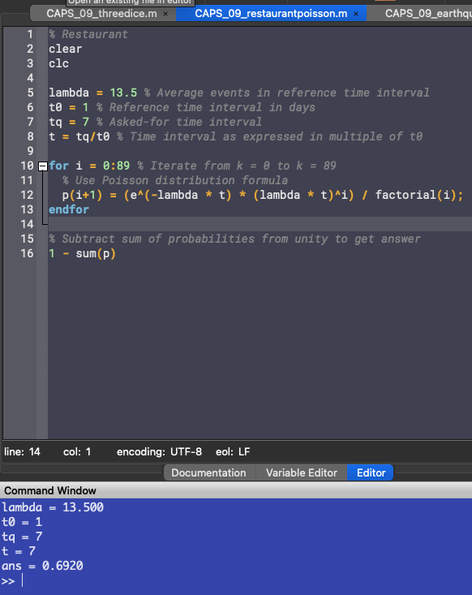
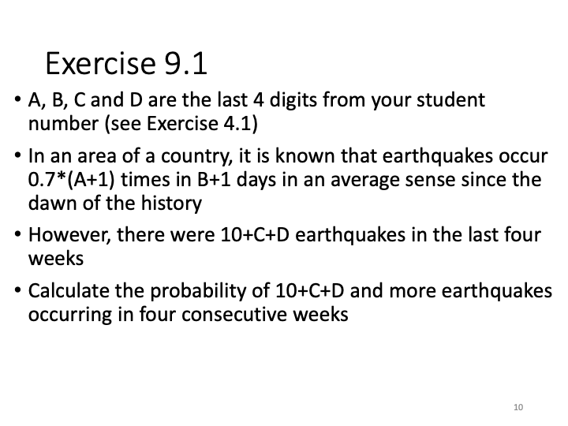
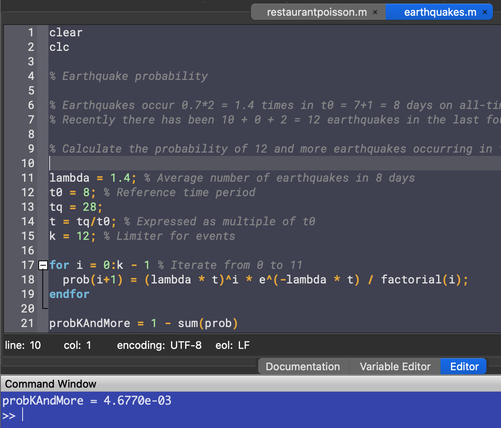
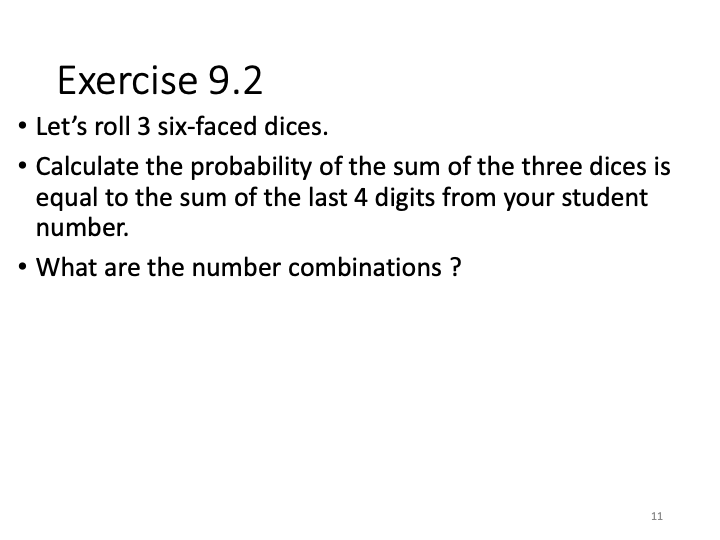
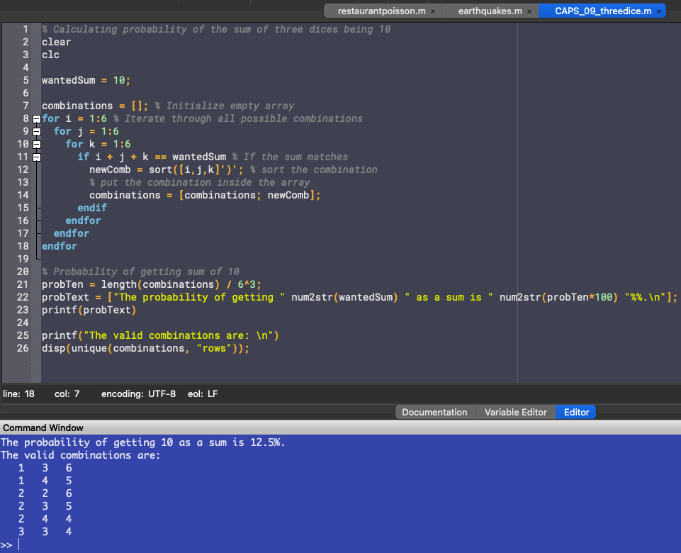

# Report 9
Maximilian Fernaldy - C2TB1702

# Part 1 - Poisson Distribution

## Introduction to the Poisson Distribution

The Poisson distribution expresses the probability of a given number of events happening in a certain amount of time, if they occur with a known, constant mean rate and the events are independent of each other (meaning, an event happening does not change the probability of more events happening after it).

The Poisson distribution can be expressed as an equation of probability of $n$ events happening in a fixed amount of time:

$$ P(X_t = k) = \frac{e^{-\lambda t} (\lambda t)^k}{k!} $$

With $P(X_t = k)$ as probability of $k$ events happening in time $t$ and $\lambda$ as average number of events that has happened in time $t$.

Something to note is that while $\lambda$ can be any positive real number, $k$ is only defined for positive integers. Let's do an example problem to understand why this is.

### An example

Suppose a restaurant is visited by $13.5$ customers per day on average. The restaurant is underground, so people can't see inside and consequently, how many customers are inside the store doesn't affect the probability of new customers visiting it.

We can then denote $\lambda = 13.5$ as the average amount of customers per day and $t_0 = 1d = 24h$ as the reference time interval.

An investor is interested in purchasing part ownership of the restaurant for a single trial week, but he wants to know if the restaurant will turn a profit. To get any return on investment (ROI), the investor needs $90$ or more customers in that week. He has a statistician calculate the probability of this happening.

Now we can get a sense of why $X_t$ and $k$ has to be integers. It doesn't make sense to try and calculate the probability of, say, $66.6\bar6$ customers visiting the restaurant in a week. Events happen in integers: either they happen or they don't, `0` or `1`.

The statistician uses the Poisson distribution to do the task assigned to them. They note that the investor wanted to know the probability of $90$ *or more* customers visiting the restaurant $(k \geq 90)$ in $t_q = 7$ days, which means an easy way to calculate this probability is to instead calculate the inverse probability, then subtract it from unity:

$$ P(X_t \geq 90) = 1 - P(0 \leq X_t < 90) $$

However, the statistician quickly realizes that plugging in these values one by one like this:

$$ P(0 \leq X_t < 90) = P(X_t = 0) + P(X_t = 1) + ... + P(X_t = 89) $$

will take too long and it's too much work for how much they're getting paid. Instead, the statistician starts up Octave and writes this code to compute the probability:

~~~matlab
lambda = 13.5 % Average events in reference time interval
t0 = 1 % Reference time interval in days
tq = 7 % Asked-for time interval
t = tq/t0 % Time interval as expressed in multiple of t0

for i = 0:89 % Iterate from k = 0 to k = 89
  % Use Poisson distribution formula
  p(i+1) = (e^(-lambda * t) * (lambda * t)^i) / factorial(i);
endfor

% Subtract sum of probabilities from unity to get answer
1 - sum(p)
~~~

 

<figure>
  
  

  <figcaption>Figure 1 - Output of restaurantpoisson.m</figcaption>
</figure>

 

Apparently, the probability of 90 or more customers visiting the restaurant is $69.2\%$. The investor is happy with this percentage, and goes through with his decision. 

## Solving Exercise 9.1

  

### Parameters
My student number is C2TB1702.
1. Earthquakes occur $0.7 \times (1+1) = 1.4$ times in $7+1 = 8$ days on average.
2. There were $10 + 0 + 2 = 12$ earthquakes in the last four weeks.

### Applying Poisson Distribution

From parameter (1), $\lambda = 1.4$ and the reference time period is $t_0 = 8$ days. From parameter (2), $k = 12$ and $t_q = 28$ days.

We want to know $P(X_t \geq 12)$, which we can calculate by subtracting its inverse from unity.

$$ P(X_t \geq 12) = 1 - P(0 \leq X_t \leq 11) $$

To calculate the inverse probability:

$$ P(0 \leq X_t \leq 11) = \displaystyle\sum_{i = 0}^{11} P(X_t = i) = \displaystyle\sum_{i = 0}^{11}\frac{e^{-\lambda t} (\lambda t)^i}{i!} $$

Because $\lambda$ is defined for the reference time interval $t_0$, to continue to use $\lambda$, we want to linearly adjust $t$ so that it is a ratio of $t_q$ and $t_0$. We can do this by dividing $t_q$ by $t_0$, which will leave use with the appropriate number for $\lambda t$. In octave code:

~~~matlab
lambda = 1.4; % Average number of earthquakes in 8 days
t0 = 8; % Reference time period
tq = 28;
t = tq/t0; % Expressed as multiple of t0
k = 12; % Limiter for events

for i = 0:k - 1 % Iterate from 0 to 11
  prob(i+1) = (lambda * t)^i * e^(-lambda * t) / factorial(i);
endfor
~~~

Then simply subtracting it from unity, we get the probability for 12 or more earthquakes happening $(P(X_t \geq 12))$:

~~~matlab
probKAndMore = 1 - sum(prob)
~~~

which outputs

<figure>
  
  

  <figcaption>Figure 2 - Output of earthquakes.m</figcaption>
</figure>

This means the probability of 12 earthquakes or more happening is *very* small under normal circumstances - smaller than $0.4\%$. This suggests that something else might be at play, something out of the ordinary that caused the sudden jump in earthquake frequency.

# Part 2 - Three Dice

  

### Parameters
The sum of the last 4 digits of my student number is $1 + 7 + 0 + 2 = 10$.

### Applying basic probability theory
When rolling three dice, the number of possible sums is actually only $16$. The lowest possible sum is $1 + 1 + 1 = 3$ and the highest possible sum is $6 + 6 + 6 = 18$. Therefore there are only $16$ possible different sums. However, they have different odds of happening. For example, to get a sum of $3$, there is only one possible combination of the three dice, that being all of them showing $1$. On the other hand, there are many different combinations that result in a sum of $7$. This means the probability of getting one sum is not equal to the others. 

This is why when calculating the probability of getting a certain sum, we can't just say it's $\frac{1}{16}$. We need to consider all the possible events and take note of the combinations that result in that sum.

Applying this to our problem, there are $6^3 = 216$ possible combinations of the three dice, and the possible events that result in a sum of 10 are:

1. $ 1 + 3 + 6 $ with unique numbers, so $3! = 6$ events
2. $ 1 + 4 + 5 $ with unique numbers, so $3! = 6$ events
3. $ 2 + 2 + 6 $ with a number appearing twice, so $3!/2! = 3$ events
4. $ 2 + 3 + 5 $ with unique numbers, so $3! = 6$ events
5. $ 2 + 4 + 4 $ with a number appearing twice, so $3!/2! = 3$ events
6. $ 3 + 3 + 4 $ with a number appearing twice, so $3!/2! = 3$ events

Adding them all up, we have $6 \times 3 + 3 \times 3 = 27$ events. The probability of getting a sum of 10 is:

$$\frac{27}{216} = \frac{1}{8} = 12.5\%$$

### Using Octave to get the probability

Counting the different probable events one by one is impractical and prone to mistakes. Instead, we can use the help of computers to do the counting for us.

It's quite apparent that a quick and easy way to do this is utilizing nested `for` loops to repeatedly check the sum of the three dice and add the combination to an array if it equals 10.

~~~matlab
wantedSum = 10;

combinations = []; % Initialize empty array
for i = 1:6 % Iterate through all possible combinations
  for j = 1:6
    for k = 1:6
      if i + j + k == wantedSum % If the sum matches
        newComb = sort([i,j,k]')'; % sort the combination
        % put the combination inside the array
        combinations = [combinations; newComb];
      endif
    endfor
  endfor
endfor
~~~

Before adding into the array, we sort the combination so we can take out the duplicates later. To compute the probability, we divide the total number of occurrences `length(combinations)` by the total number of possible events, $6^3 = 216$.

~~~matlab
% Probability of getting sum of 10
probTen = length(combinations) / 6^3;
probText = ["The probability of getting " num2str(wantedSum) " as a sum is " num2str(probTen*100) "%%.\n"]; % Show probability as percentage
printf(probText)
~~~

To display the combinations that result in a sum of 10, we can use the `unique()` function. This function searches for duplicates, deletes them and sorts the remaining entries in ascending order. The documentation for `unique()` can be found <a href='https://docs.octave.org/v8.2.0/Sets.html'>here</a>.

~~~matlab
printf("The valid combinations are: \n")
disp(unique(combinations, "rows")); % Display unique combinations
~~~

As we don't need to show differently ordered, but otherwise identical combinations, this function is perfect for our purpose. The output of this script is:

<figure>
  
  

  <figcaption>Figure 3 - Output of threedice.m</figcaption>
</figure>

Comparing this to our earlier manual computation, we get the same result.

[comment]: <> (Below is CSS code for the output HTML and pdf files. Don't touch them unless you know what you're doing.)

