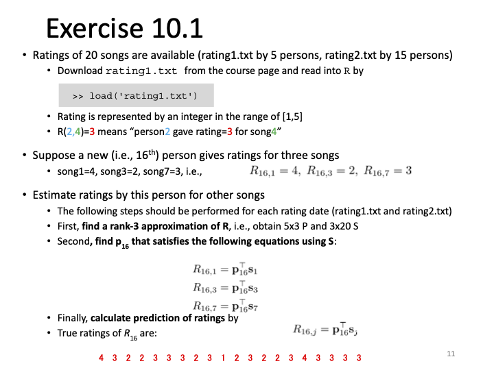
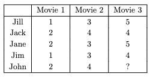
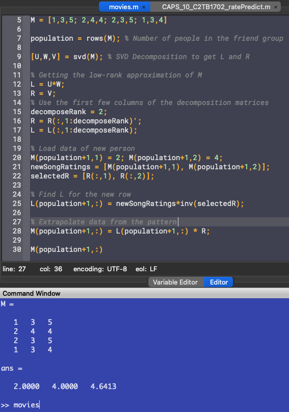
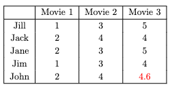
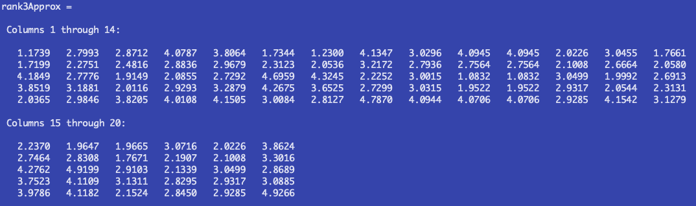
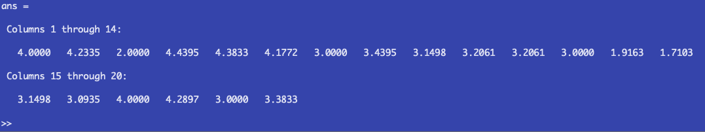
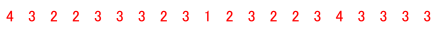
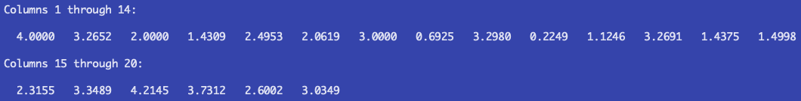
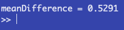

# Report 10
Maximilian Fernaldy - C2TB1702

  

## Introduction to Low-Rank Approximation

To completely understand low-rank approximation, a basic understanding of linear algebra is required, especially knowledge about the concepts of rank, matrix decomposition and Gaussian elimination. However, a part of it can be understood by visualization without the need of linear algebra prowess.

Imagine a matrix $X$. This matrix can encode data of any kind, such as pictures, exam scores, survey data, or anything. If matrix $X$ has $n$ columns, it doesn't necessarily mean that it has $n$ unique columns. Some columns might be able to be expressed as other columns multiplied by some number. The number of unique columns in a matrix is what we call *rank*. Rank is useful in conveying the complexity of a data set and approximating a data set. Imagine if a video file had to contain independent images that don't correlate at all with each other. The file size would be very large and inefficient. Conversely, an image file that doesn't make use of the patterns in the image, blindly storing pixel by pixel of data will bloat in size very quickly. This is one of the most useful applications of approximation: data compression.

Now imagine adding incomplete data to matrix $X$, if we know that the new data has the same patterns as the other data, we can get an approximation of the actual missing data by finding those patterns in the old dataset and applying it to the new data to find the best fit.

This is where low-rank approximation comes in. For the matrix $X$ with rank $r$, we can create an approximation of that matrix, with a lower rank. This approximation will allow us to interpolate missing properties of a new data point.

### An example

Suppose that in a group of 5 friends, we have a movie-rating system from 1 to 5. The 5 friends have similar taste, but not exactly the same. They tend to like the same kinds of movies, which is why they established this system. They watch the same movies each week and rate them after watching so the others can know how good a movie was.

Let's say that one week, one of the friends in the group, called John, was busy with homework from his engineering classes. He only had time to watch 2 out of the 3 movies that they agreed to watch. He still wants to watch the remaining one, but the friends need an approximation of how he would rate the movie so they can fill in a temporary data while they wait for him to watch the movie. Well, this is a perfect opportunity to use low-rank approximation.

<figure>
  
  

  <figcaption>Figure 1 - The friends' movie rating system in a certain week</figcaption>
</figure>

Jack is a mathematics major and he is a wizard at Octave. He starts up Octave and quickly began loading data and writing code:

~~~matlab
M = [1,3,5; 2,4,4; 2,3,5; 1,3,4]

population = rows(M); % Number of people in the friend group
~~~

Loading in the movies as columns and people as rows, he made sure that his code was dynamic and that adding friends into the group would be easy. This is done by making the size of the `population` self-adjusting to the number of rows in the matrix, which means he can add new data to the matrix without breaking the code.

After this, he uses Octave's built-in SVD function to decompose the matrix.
~~~matlab
[U,W,V] = svd(M); % SVD Decomposition to get L and R

% Getting the low-rank approximation of M
L = U*W;
R = V;
~~~
He also immediately converts the $UWV$ matrices into the matrices $L$ and $R$ needed for low-rank approximation. He found the formula for converting SVD matrices into low-rank approximation <a href='https://dustinstansbury.github.io/theclevermachine/svd-data-compression'>here</a>.

Next, he noticed that the dimensions need adjustment for the approximation:
~~~matlab
% Use the first few columns of the decomposition matrices
decomposeRank = 2;
R = R(:,1:decomposeRank)';
L = L(:,1:decomposeRank);
~~~
Now the dimensions are right. To visualize, this is what the matrices look like now:

<figure>
  
  

  <figcaption>Figure 2 - Visualization of a low-rank approximation</figcaption>
</figure>

As he only has a matrix of rank 3, he decides to use rank 2 approximation. He then adds the incomplete data he got from John:
~~~matlab
% Load data of new person
M(population+1,1) = 2; M(population+1,2) = 4;
newSongRatings = [M(population+1,1), M(population+1,2)];
selectedR = [R(:,1), R(:,2)];
~~~

He selects the first two movies for $R$ so that the approximation will take into account what John thinks about the first two movies as well. Satisfied with his set-up, he then finds the $L$ for the new row by setting up this system of linear equations:

$$ M_{5,1} = L_5 R_1 \\ M_{5,2} = L_5 R_2 $$

He realizes he can solve for $L$ by inverting $R$:

$$ M_{5,12} = L_5 R_{12}\\ L_5 = M_{5,12} R_{12}^{-1} $$

*Note that the notation 5,12 means row 5, columns 1 and 2.*

which he then converts into code:
~~~matlab
L(population+1,:) = newSongRatings*inv(selectedR);
~~~

Finally, he can approximate John's rating for the remaining movie:
~~~matlab
% Extrapolate data from the pattern
M(population+1,:) = L(population+1,:) * R;

M(population+1,:)
~~~

This outputs the following:

<figure>
  
  

  <figcaption>Figure 3 - Output of movies.m</figcaption>
</figure>

John is projected to rate the movie a 4.6 out of 5. The friends can now fill in the missing data and carry on with their week.

<figure>
  
  

  <figcaption>Figure 4 - The approximated rating predicts John will like the movie</figcaption>
</figure>

## Problem 1

In problem 1, we are asked to find a rank-3 approximation of R, which is a matrix containing rating data of 20 songs by a population of people. This is very similar to the example problem, except for some differences in the data size and naming.

For the explanation, we will use the first data set as it is smaller and easier to manage for explanation purposes. The script we will be using can work with both data sets, provided the correct data set is loaded.

First, we load the data set we want, and get the number of people who have already rated the songs.
~~~matlab
% Load the rating data into R. Change datasets here.
load('rating1.txt')

population = rows(R); % Number of people rating songs
~~~

Next, we use the built-in SVD function to get values of $P$ and $S$, which we will use for low-rank decomposition.
~~~matlab
[U,W,V] = svd(R); % SVD Decomposition to get P and S
~~~

Since we want to get a rank 3 approximation of the matrix, we set `decomposeRank` to 3 to make sure we only use the first 3 columns of the matrices and adjust the dimensions of $P$ and $S$.
~~~matlab
% Getting the rank 3 approximation of R
P = U*W;
S = V;
% Use the first three columns of the decomposition matrices
decomposeRank = 3;
S = S(:,1:decomposeRank)';
P = P(:,1:decomposeRank);
~~~

To show the approximated matrix, we can multiply P and S according to the general low-rank approximation formula:

$$ R_k = P_k S_k $$

~~~matlab
rank3Approx = P*S % Rank 3 approximation of the matrix
~~~

Which outputs:

<figure>
  
  

  <figcaption>Figure 5 - The rank 3 approximation of the ratings matrix</figcaption>
</figure>

## Problem 2

For the next step, we want to extrapolate missing data from a new person.

We can load the incomplete data of the new person into the data set, adding a new row.
~~~matlab
% Load data of new person
R(population+1,1) = 4; R(population+1,3) = 2; R(population+1,7) = 3;
newSongRatings = [R(population+1,1), R(population+1,3), R(population+1,7)];
selectedS = [S(:,1), S(:,3), S(:,7)];
~~~

This time, instead of 2 known movie ratings, we have 3 song ratings. However, there are 20 songs in total, which means we have to approximate a staggering 17 ratings from the new person. Since the songs that the person rated were not the first 3, we also need a more specific indexing method than the one used in the example problem. We select all the elements in column 1, 3 and 7 of $S$, because those are the columns that we have the definite data from the new person.

Finally, we can find the new row of $P$, which is analogous to $L$ in the example problem, by multiplying the array containing the known song ratings with the invert of the array containing the corresponding $R$ entries. Similar to the example problem, for the first data set we have:

$$ R_{6,1} = p_6 s_1 \\ R_{6,3} = p_6 s_3 \\ R_{6,7} = p_6 s_7 $$

$$ R_{6} = P_6 S_{137}\\ P_6 = R_6 S_{137}^{-1} $$

However, we must realize that with bigger data sets, inverse matrices take increasingly longer to compute, which will slow down the extrapolation process by a lot when working with a large enough data set. Instead, we should use the Gaussian elimination. However, we want to solve for $P$, which does not fit into the general Gaussian Elimination formula:

$$ AX = B, \mathrm{\:solve\:for\:} X $$

Luckily, we can use transposition in this manner:

$$ R_{6,137} = P_6 S_{137} \Rightarrow R^T_{6,137} = S^T_{137} P^T_6 \Rightarrow P^T_6 = S^T_{137} \backslash R^T_{6,137} $$

*Note: the notation 6,137 means the sixth row, columns 1, 3 and 7. The backslash indicates the gaussian elimination operator in Octave. Such notation doesn't actually exist in maths, but this suffices for the purpose of the report.*

By using Gaussian elimination, we can get the transpose of $P_6$, which means if we just transpose it again, we will get the sixth, new row of $P$. In code form:

~~~matlab
% Gaussian elimination is faster than inverse matrices in large data sets.
P(population+1,:) = (selectedS'\newSongRatings')';
~~~

Finally, we can approximate the missing 17 data properties using the newly acquired row of $P$.
~~~matlab
R(population+1,:) = P(population+1,:) * S;
~~~

Which is just a row-specific form of the general approximation formula: $R = PS$. Displaying only the new row, we get these values:

<figure>
  
  

  <figcaption>Figure 6 - Output of ratePredict.m</figcaption>
</figure>

Comparing this to the actual ratings, we see that excluding the known data in songs 1, 3 and 7, there are serious discrepancies between the approximated rating and the actual rating:

<figure>
  
  

  <figcaption>Figure 7 - The real ratings of the new person</figcaption>
</figure>

To quantify this, let's take the mean differences of the datasets:

$$ M.D. = \frac{\displaystyle\sum_{i=1}^{n}|x_i - y_i| }{n} $$

This formula compares each corresponding values of the two datasets, finds their difference, adds them up and divides them by the number of data points. Applying this to Octave:

~~~matlab
% Average difference
differences = abs(R(population+1,:) - actualratings)
meanDifference = sum(differences)/songs
~~~

Running this with the first dataset outputs:

<figure>
  
  

  <figcaption>Figure 8 - The mean difference is high</figcaption>
</figure>

Which means each rating is off by $0.77$ points on average. This high mean difference is due to many reasons, some of which include the very low data sample size and the unknown relationship between the listeners if there is even a relationship at all. It might be that the six listeners has nothing in common with each other, which means we cannot use the patterns in the data to extrapolate ratings. This is why we need to understand algorithms to use them. We need to understand what an algorithm takes into account, what it does exactly with the data, what its strengths and limitations are. Because no algorithm is perfect and all-knowing. Data can be manipulative and sneaky a lot of times. A complete and thorough understanding of the algorithm we use will help in getting better predictions and extrapolated data.

## Output of the second data set

Does having more data points to start with make the prediction more accurate? We find out by replacing the dataset to a larger one:

~~~matlab
% Load the rating data into R. Change datasets here.
load('rating2.txt')
~~~

which outputs:
<figure>
  
  

  <figcaption>Figure 9 - Approximated ratings of the sixteenth person</figcaption>
</figure>

We find out that the mean deviation is considerably less than the smaller dataset's:

<figure>
  
  

  <figcaption>Figure 10 - The mean difference has gone down a considerable amount</figcaption>
</figure>

This is still a fairly inaccurate approximation of the listener's taste. To get better approximations, a data scientist should find out the relationship between the different listeners. Do they tend to gravitate toward the same genre of music? Are they from the same region of the world? What sort of preferences do they have in common? Knowing these factors can help algorithms cluster data points into better groups, which will drive the accuracy of prediction models upwards.

## Footnotes
From this exercise, we have learned that matrix decomposition and approximations are very useful in digital file handling, big data processing and pattern predictions. However, the complete understanding of algorithms is needed to utilize them to their full potential. Otherwise, predictions might just as well be random.

Additionally, it can be learned that when writing code for data, it's best to generalize when possible. This allows for dynamic data handling, which means the code does not need to be changed to accommodate changes in data size. Not only does this save time and energy, it's cleaner and more efficient.

[comment]: <> (Below is CSS code for the output HTML and pdf files. Don't touch them unless you know what you're doing.)

