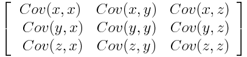
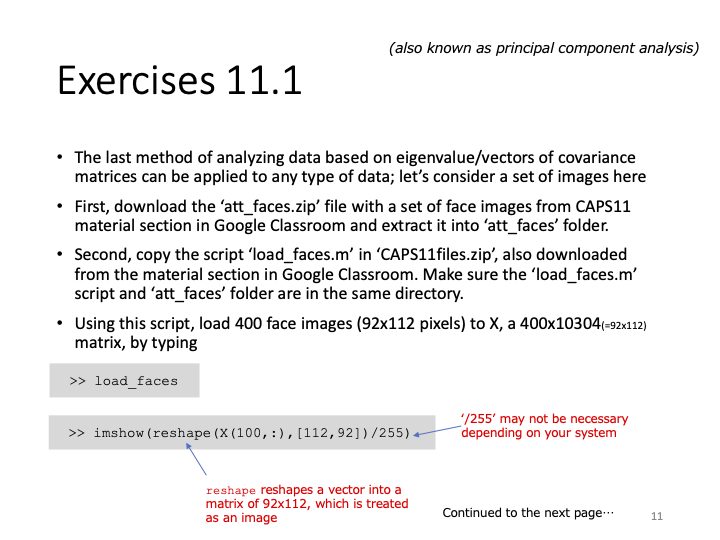
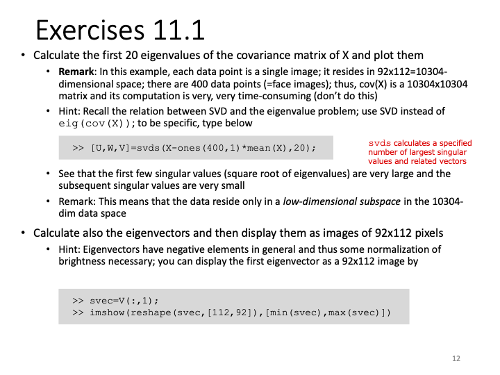
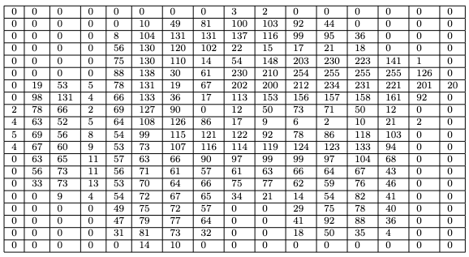

# Report 11
Maximilian Fernaldy - C2TB1702

## Introduction to Principal Component Analysis in Data Science

Matrices are massively useful in big data and machine learning. They can represent data very efficiently and intuitively. Particularly when talking about big data, eigenvalues and eigenvectors are by far the most important properties of a matrix. They can be used to extract the most important features or information from a dataset by identifying the "directions" of maximum variation in the data. Note that we did not specify a type of data, because they can be used to analyze many different types of data, from numbers, boolean values, images, and mixtures of them.

In this report, we are going to do what's called Principal Component Analysis, which makes effective use of these two tools. In the context of data analysis, PCA is used to reduce the dimensionality of large data sets by transforming a large set of information into smaller pieces that still contain the most important information of the original set. PCA is better visualized by an intuitive thought experiment.

### An example

Imagine we're doing a general survey on the GPA of an engineering program at a certain university. However, we don't have enough data to ascertain what kind of things we should ask people around for. This is called **exploratory research**. We don't know yet which variables affect the GPA at this particular engineering program, so we need to find out. To do this, we come up with things that we think are relevant to someone's GPA, such as hours spent studying in class, hours spent self-studying, hours of sleep, and so on, alongside basic values like age, gender, nationality, economic background, and so on. Notice how even with the first few variables, we are already at seven different variables. Not to mention the fact that we have to ask a large number of people to make the data reliable.

Let's say we collect the data in a spreadsheet. An excel file is, at the end of the day, just a matrix containing different types of data. For a survey with a size of 100 students asked and 7 properties received, we would need 700 different data points. It might not seem like much in the grand scheme of things, but when we have to do complicated, resource-intensive and recursive calculations on the data, we would need exponentially increasing computing power.

This is why we need methods for *dimensionality reduction*. The name is self-explanatory, really. We want to reduce the 100 by 7 matrix into a lower dimensional format while preserving the most important information, like the covariance between two arbitrary columns. This is what we call PCA.

To do PCA with multi-variable numerical data, first we want to standardize data so that the variables contribute equally to the analysis. For example, without standardization, since age differences are very slight among undergraduate engineering students when compared to the difference of their total hours of study, the two variables might have their respective impacts on GPA skewed relative to each other. By standardizing the data into values of $z$, we can make sure this does not happen. To do this, we make use of this very simple formula:

$$ z = \frac{value-mean}{standard\:deviation} $$

Once this is done, all our numerical variables will be on the same scale, and therefore be analyzed equally.

The next step is the covariance matrix computation. The covariance matrix looks intimidating at first, but it's very intuitive in reality. It just helps us understand how the input variables are deviating from the mean with respect to each other. In simpler words, we can see how the variables relate *to each other*. This is done because sometimes, variables are so highly correlated to each other that they might contain redundant information.

A covariance matrix is arranged in this way:

<figure>
  
  

  <figcaption>Figure 1 - A 3x3 covariance matrix</figcaption>
</figure>

We can try to formulaically define covariance, but I believe the intuitive meaning of the concept is more useful. A positive covariance means two variables increase and decrease together. They are *correlated*, to a certain extent. A negative covariance means one variable increases when the other one decreases. They are *inversely correlated*.

For example, let's say we have two variables: time spent doing homework assignments and time spent on studies outside of class. These two variables might contain information that's very close to each other, if, say, the students have so much homework that they don't have time to self study. This makes the time they spent on studies outside of class almost equivalent to the time spent doing homework, which means we don't have much use for gathering both of these, when we can just ask for one of them.

Covariance matrices are especially useful in exploratory research, as we can very easily tell which variables don't correlate at all to the output variable, which variables correlate strongly, and which variables are redundant and unnecessary to collect information of.

Carrying on with the next step, we want to identify the *principal components* of the data set. Principal components are, as the name suggests, the most important components of a data set. This means with few principal components, we can get a good idea of what a data set is "saying", what it means. They are constructed as *linear combinations* or *mixtures* of the initial variables. The construction is done in such a way that the new components are uncorrelated, and as much information as possible is compressed into the first components.

What does this mean in relation to the covariance matrix? Well, notice in Figure 1 that the covariance matrix contains a *lot* of redundant data points. A covariance matrix has a diagonal of 1s, because the diagonal of the matrix computes the covariance of each variable column with itself. Obviously we don't need this data. Also, covariance is *commutative* by definition - $Cov(A,B) = Cov(B,A)$. Notice how this means the matrix is effectively mirrored (the proper term is symmetric) to the diagonal, which means we have information that is over twice the size it should be.

Since what we want to get out of this exploratory research is data on which variables have correlation to the GPA, which variables are correlated to each other and which variables are redundant, we don't actually need to retain *all* of the data to identify their relationships. We only need the principal components.

In the context of our thought experiment, the principal components represent the "directions" of data that contains the maximal amount of variance. They can be said to be the closest thing to a linear relationship in a data set. Maybe the component that is directly proportional to graduation chances is a balanced combination of hours of study, hours of sleep and hours of self care and relaxation.

These principal components that we have been talking extensively about is precisely the things that are represented by the eigenvectors and eigenvalues when we take data in matrix form. The eigenvectors of a covariance matrix are the directions in the data where there is the most variance. The eigenvalues are the scale of the eigenvectors, which means the bigger they are, the larger the amount of variance is carried.

If we rank our eigenvectors by descending order of our eigenvalues, we will get the principal components in order as well.

Once we have collected all the data from our hypothetical survey, we can export the spreadsheet into a csv and load it into Octave. We then take the covariance matrix of the input variables, perform SVD on it to get the eigenvalues and find the most significant eigenvectors, and display the results on a plot. We then discover the variables that have a strong correlation with GPA, publish our results, and help our fellow students.

## Exercise 11.1

  

  

Exercise 11.1 presents us with a fascinating application of data science: image analysis. This application truly hammers home the important notion (and undisputable fact) that *everything* is or can be represented by data. At the end of the day, digital images are just a bunch of pixels with different values defining each one, ordered in a certain way. If we obtain a batch of images that we *know* have some type of commonality with each other, we can perform lots of different analysis. These are the building blocks of technology like pattern and image recognition, FaceID, Tesla Autopilot, and many more cutting-edge applications. Imagine if we need to position our faces in one exact specific way every time we want to unlock our iPhones, or position our thumb the same exact way every time on the fingerprint reader. Pattern recognition enables computers to see slightly different alterations of the same object as what they are—alterations, not entirely different faces, or fingerprints.

We are provided with 10 images each of 40 people. Most of the images are upright, frontal positions with some tolerance for side movement, as stated by the README file. What this means is that there is a certain pattern of the faces, although the images are obviously different.

Another note is that the faces provided are in `.pgm` (Portable Gray Map) format, which means they only contain information of luminosity—greyscale, so to speak. This means each pixel in a `.pgm` image only contains one or two bytes (8 or 16 bits) of information, allowing a pixel to store up to $16^2=256$ values. To compare this to a `.png` file, a single pixel can represent 256 values in 3 channels: up to $256^3 \approx 16.7 \:million$ different colors.
*A complete specification of the .pgm file format can be obtained <a href='https://netpbm.sourceforge.net/doc/pgm.html'>here</a>*.

This doesn't mean `.pgm` files are useless though, far from it. The format can still let a program recognize patterns and correlations while simultaneously allowing our relatively slow (when compared to supercomputers) consumer-grade computers to be able to process hundreds of images (in turn, hundreds of thousands, if not millions of pixels) and extract information from them without encountering an error.

As we can see from this random picture in the bunch, a `.pgm` file can show a face just fine:

<figure>
  
  

  <figcaption>Figure 2 - A .pgm file exported to .png to comply with HTML figure formats</figcaption>
</figure>

### Problem 1

In the first problem, we are tasked to load the images into Octave using the provided `load_faces.m` file, then perform SVD on the file to get its largest eigenvalues, and plot them.

First we have to understand what we are doing instead of following the steps blindly. We have already demonstrated what covariance means in an exploratory research study, but what does it mean to find the covariance in image files?

Well, again, images can be thought of an arrangement of pixels, which have numerical values that define them. Specifically in the `.pgm` format, each pixel has a numerical value defining its brightness. This means that every pixel can be thought of as a *scalar* element of a certain matrix. What is this matrix? Well, it contains all the information of the image. Let's think of a very small image: 

<figure>
  
  

  <figcaption></figcaption>
</figure>

If we think of this 16 by 32 pixel image as a matrix of brightness values, that is exactly what a `.pgm` file is. Reading the file in Octave and writing the values into a `.csv` file (redread.m),

~~~matlab
% Read .pgm file and write data to csv file

sus = imread("red.pgm");
csvwrite("matrixred.csv", sus);
~~~

we get this table:

<figure>
  
  

  <figcaption>Figure 3 - The image represented as brightness values from 0 to 255</figcaption>
</figure>

But this means the image itself has two dimensions. However, we can just as well represent the data in this image by ordering every pixel to the right as an ordered list. This way, we can directly put every image in a matrix as rows. In fact, this is *exactly* what `load_faces.m` does!

#### Loading the faces into a matrix (load_faces.m)
~~~matlab
face_dir = "att_faces";
num_persons = 40;
num_imgs_each = 10;
num_imgs = num_imgs_each*num_persons;
X = zeros(num_imgs, 92*112);
~~~

First, the script defines the name of the directory where all the subjects are located. Next, it defines the number of persons to iterate through, which is 40 in total. Then it defines how many pictures each person has taken of them. By simple logic, the total number of images is just the number of images each person has multiplied by how many people there are. Next, the script initializes `X` as a zero matrix with number of rows equal to the number of images and number of columns equal to $92\times112$. This is the size of the photos—92 pixels wide and 112 pixels high. It's obvious now that this matrix `X` contains all the images in `att_faces` as rows.

~~~matlab
for i=1:num_persons,
  for j=1:num_imgs_each,
    filename = sprintf("%s/s%d/%d.pgm", face_dir, i, j);
    imgs = imread(filename);
    X((i-1)*num_imgs_each+j, :) = reshape(imgs,[92*112,1]);
  end
end
~~~

This `for` loop iterates through each person and each image file name, formats the filename with `sprintf` and reads each file with `imread`. After reading the data, we get a matrix similar to Figure 3 (but way larger in size). In order to imagine the image as a one dimensional object, we reshape the matrix to be a list with $92\times112$ rows and a single column. We then assign that column vector to the corresponding row (effectively transposing it into a row vector), representing that image in a single row in matrix `X`.

#### Taking the covariance matrix and resolving its eigenvectors and eigenvalues (eigenfaces.m)

*Note that* `eigenfaces.m` *requires* `load_faces.m` *in the same directory for it to work.*

We've ended up with data very large in size, which means it's now time to apply what we've learned in the introduction: Principal Component Analysis. Remember, though, that the actual covariance matrix of a data set still contains a lot of redundant information. Well, the PCA theorem states that for the covariance matrix $Q$:

$$ Q \propto \tilde X^T \tilde X $$

where,

$$ \tilde X = X - J_{m \times 1} \bar x_{columnwise} $$

$$ \bar x_{columnwise} = \begin{bmatrix}\bar x_{1} & \bar x_{2} & \dots &  \bar x_{m} \end{bmatrix}$$

and

$$ \bar x_{j} = \frac{1}{m} \displaystyle\sum_{i=1}^{m}x_{ij} $$

Going through this one by one, PCA states that the covariance matrix Q is proportional to $\tilde X^T \tilde X$, where $\tilde X$ can be constructed as our original matrix $X$ subtracted by the column-wise mean of $X$.

To elaborate further, we want to take the sum of all entries in a given $j^{th}$ column of $X$ and divide it by the total number of rows $m$, which gives us $\bar x_j$, then elongate $\bar x_j$ downwards by multiplying it to a matrix of ones denoted by $J_{m \times 1}$. We then subtract that elongated matrix from $X$ to get $\tilde X$, and multiply $\tilde X^T$ with $\tilde X$ to get a matrix that is proportional to the covariance matrix $Q$.

What this means in reality, is that because all the pictures provided have the same number of pixels, we are assigning each pixel of a $92 \times 112$ image to a column in our $400 \times 10304$ matrix. Going through the same pixel in every image, we then take the average level of brightness of each pixel, and then copy the values downwards so that we return to the original row size of $400$. Lucky for us, the function `mean(X)` in Octave already returns a row vector of the column-wise mean when `X` is a matrix. Refer to the documentation <a href='https://docs.octave.org/v8.2.0/Descriptive-Statistics.html#index-mean:~:text=If%20x%20is%20a%20matrix%2C%20then%20mean%20returns%20a%20row%20vector%20with%20the%20mean%20of%20each%20column%20in%20x.'>here</a>.

~~~matlab
P = ones(400,1)*mean(X); % Column-wise mean elongated to 400 rows
~~~

<figure>
  
  

  <figcaption>Figure 4 - A portion of the column-wise mean matrix</figcaption>
</figure>

After that, we subtract the average matrix from our original matrix, giving us a matrix of the difference between each and every single pixel's brightness to the average level of brightness of that pixel:

~~~matlab
brightDif = X - P; % Difference of brightness level with mean
~~~

<figure>
  
  

  <figcaption>Figure 5 - A portion of the difference matrix</figcaption>
</figure>

Notice that `brightDif` is equivalent to $\tilde X$ in math form. This means `brightdif' * brightdif` is proportional to `cov(X)`. We are now ready to do Singular Value Decomposition to find the eigenvalues and eigenvectors, but before that, we need some more theory to understand the significance of the eigenvectors and eigenvalues of $\tilde X^T \tilde X$.

PCA dictates that in the decomposition of $\tilde X$ into $UWV^T$, the columns of $V$ are *eigenvectors* of $\tilde X^T \tilde X$, and the non-zero elements of our diagonal matrix $W$ are square roots of the *eigenvalues* of $\tilde X^T \tilde X$. If we recall that $\tilde X^T \tilde X$ is proportional to our covariance matrix $Q$, this means we have found the eigenvectors and eigenvalues proportional to those of our covariance matrix. We just need a few more simple operations, namely to square the elements of $W$ to find the eigenvalues, prepare the eigenvectors in $V$ for display, and then we can show them in image form.

Let's do this in Octave:

~~~matlab
[U,W,V] = svds(brightDif,20); % SVD of brightDif
~~~

This line decomposes `brightDif` into singular values, but with `svds()`, we don't find *all* of the singular values. Remember that with PCA, we don't need *all* of the data to represent a lot of the information contained in it. We just need the few most significant principal components. In this exercise, we have chosen 20 singular values. Luckily, with `svds()`, the function automatically selects the largest $k$ singular values when `svds(A, k)` is called.

~~~matlab % Square all diagonal elements of W and put inside eigval
for i=1:20
  eigval(i) = W(i,i)^2;
end
~~~

With this block of code, we square the diagonal elements of the square $20 \times 20$ matrix $W$ and store them in the array called `eigval`. As prompted by Problem 1, we can plot the eigenvalues like this:

~~~matlab
figure(1)
clf
plot(eigval,"+","markersize",8,"color","r")
title("Largest 20 eigenvalues")
~~~

<figure>
  
  

  <figcaption>Figure 6 - The largest 20 eigenvalues obtained from att_faces</figcaption>
</figure>

Notice how the first few eigenvalues are incredibly large, but then it drops off a whole order of magnitude after only 9 different eigenvalues. This is what is meant by the data residing in a *low-dimensional subspace*. The name sounds very complicated, but it essentially means the data doesn't have a whole lot of variance, so much so that PCA doesn't have any trouble compressing it. A whole lot of the information can be retained by keeping a few principal components, or singular values, of the data.

Recall that the number of pixels in every image is not small. Every image has $92 \times 112 = 10304$ pixels in it, each of them containing $256$ different possible values. Not to mention we have $400$ different images. After all, these are images. Just by looking at them, we know that they contain a lot of information. And yet, since there are certain patterns to the images, such as all of them being human faces positioned in a certain way, PCA can recognize these patterns and find the principal components. We were able to compress all of that data into a more processable and decipherable set of relationships.  This is why Principal Component Analysis is such an important part of Data Science and Analysis.

### Problem 2

Problem 2 asks us to show the corresponding eigenvectors of the eigenvalues we have found in order of significance. What this means is that not all eigenvectors are created equal. With PCA, some eigenvectors span significantly more information than others. Remember that every eigenvector has a related eigenvalue attached to it. In the context of our exercise, this means the eigenvector with the largest eigenvalue contains the largest amount of information that can be obtained from a single picture. With this eigenvector (in conjunction with other eigenvectors), we can construct close approximations of lot of different images from the original set. Well, this means we can just show the eigenvectors in order of the size of the eigenvalue. The eigenvector with the largest eigenvalue goes first, then the second largest goes second, and so on. Conveniently for us, the function `svds` already orders the singular values in such a way that the most significant values are indexed first. The problem of showing the eigenvectors in image form is then trivial matter:

~~~matlab
figure(2)
clf
for j=1:20
  svec=V(:,j); % Iterate through columns of V
  dimReshape = reshape(svec,[112,92]); % reshape to correct dimensions
  rescaled = scaleimg(dimReshape, 0, 1); % normalize brightness values
  subplot(4,5,j); % assign the correct subplot
  imshow(rescaled); % show image in figure window
  % imshow(dimReshape, [min(svec), max(svec)]); % old method
  filename = sprintf("./eigenfaces/eigenface %d.pgm", j); % set filename for imwrite
  imwrite(rescaled, filename); % write new pgm file for eigenfaces
endfor
~~~

First we iterate through the 20 columns of `V` and assign the current column to the variable `svec`, which stands for singular vector (proportional to the eigenvectors). This `svec` is essentially what we are going to display.

For the purposes of PCA, in `load_faces`, we had to reshape the matrices representing the pictures into row vectors of size $1 \times 10304$ and put them inside the matrix `X`. However, we can imagine that trying to display these images without reshaping them back to their original form will result in *very* long and thin strips. To revert our reshaping, we need to do `reshape()` again, this time passing a different argument for the size:

~~~matlab
dimReshape = reshape(svec,[112,92]); % reshape to correct dimensions
~~~

This line reshapes the current eigenvector iteration `svec` from a column vector into a matrix of size $92 \times 112$, conforming to the dimensions of the original images. As usual, the complete documentation of `reshape()` can be found <a href='https://octave.sourceforge.io/communications/function/reshape.html'>here</a>.

But first, notice that vectors can have negative values in them. However, brightness values are strictly from 0 to 255. This is why we need to do normalization before displaying the pixels, and this is what `min(svec)` and `max(svec)` do in the original code. The full documentation of `imshow` can be accessed <a href='https://octave.sourceforge.io/octave/function/imshow.html'>here</a>, but to explain it briefly, `imshow()` in this application takes two arguments: first, our reshaped matrix `dimReshape` that contains the brightness values, and second, the *limits* of the values in the matrix: `[min(svec),max(svec)]`. This will allow `imshow` to scale the brightness levels inside our matrix, so that the lowest value in the matrix becomes brightness level 0 and the highest value becomes brightness level 255. Without this normalization, the images won't be able to show properly.

However, since we're going to also write the eigenfaces into new .pgm files using `imwrite()`, we can't use the built-in normalization in `imshow()`. The good news is we can write a new function that normalizes our values for us each time we want to rescale an image:

~~~matlab
% Function to rescale image data matrices
function imgout = scaleimg(imgin, minval, maxval)
  imgout = imgin - min(imgin(:)); % shift lowest to 0
  imgout = (imgout/range(imgout(:)))*(maxval-minval);
  imgout = imgout + minval;
endfunction
~~~

First we shift the minimum value of the matrix to 0 by subtracting *all* elements in the matrix by the minimum value. Then we scale the range of values inside the matrix to the new range defined by `minval` and `maxval`. Finally we add `minval` to all values to cover for cases when the `minval` is not equal to zero.

If we call this function like this:

~~~matlab
rescaled = scaleimg(dimReshape, 0, 1); % normalize brightness values
~~~

we will get the matrix normalized to values between 0 and 1, conforming to the range that `imshow()` and `imwrite()` takes for brightness levels. We are now ready to show and save the images.

~~~matlab
subplot(4,5,j); % assign the correct subplot
imshow(rescaled); % show image in figure window
~~~

To show the 20 eigenvectors in a single figure window, we use `subplot()`. Doing this for each eigenvector yields this result:

<figure>
  
  

  <figcaption>Figure 7: The "eigenfaces" of att_faces</figcaption>
</figure>

*The images saved with* `imwrite()` *can be viewed in more detail <a href='https://drive.google.com/drive/folders/1pXT4GSwsMegLOhP56z3Jts7OK7vLy1qY?usp=sharing'>here</a>.*

Combinations of these "eigenfaces" varied to different scales of opacity and placed on top of each other will result in a reconstruction of faces in the original data set. We have successfully achieved image data compression.

## Footnote

- Exercise 11.1 demonstrates that data science does not stop at numbers and boolean values. It can extend to other fields that at first might not seem relevant.
- Image analysis doesn't have to be inaccessible. It is not technological magic only achievable by megacorporations. Instead, they can be done with relatively simple algorithms that can be mastered in a day.
- With large sized data, we need to find other ways of extracting information without having to use the entirety of it.
- Algorithms that might seem daunting and complicated at first, when visualized, will make sense eventually.

## Attribution
The images used in this report were taken between April 1992 and April 1994 at the Olivetti Research Laboratory in Cambridge, UK. This attribution is done in compliance with the request of the README file in the `att_faces` directory.

## Resources and further reading

1. <a href='https://en.wikipedia.org/wiki/Principal_component_analysis'>Principal Component Analysis</a>
2. <a href='https://en.wikipedia.org/wiki/Singular_value_decomposition'>Singular Value Decomposition</a>
3. <a href='https://www.youtube.com/watch?v=7Gtxd-ew4lk&list=PLWhu9osGd2dB9uMG5gKBARmk73oHUUQZS'>Video series on visualizing matrices and operations on them</a>
4. <a href='https://www.3blue1brown.com/lessons/eola-preview'>Complete video course on intuitive linear algebra</a>

[comment]: <> (Below is CSS code for the output HTML and pdf files. Don't touch them unless you know what you're doing.)

