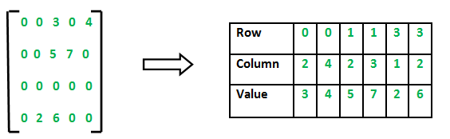

# Report 12
Maximilian Fernaldy - C2TB1702

## Introduction to linear classification and basic machine learning

Machine learning is defined as the process by which a computer can improve its performance at various tasks by continuously incorporating new data into a previously existing statistical model. In the context of image recognition, the machine learns by recognizing patterns and shapes in many images, training itself to be better and better at identifying the same shapes and patterns in other images, which will in turn increase its predictive accuracy.

Machine learning is built on many concepts, but perhaps the most basic of them is linear classification. Linear classification is a method of differentiating *classes* of data by essentially drawing lines that exist between said classes. In a two-dimensional data space, linear classification draws a line such that the distance between the nearest points on the different classes are as far as possible from the line. We know that the linear equivalent of a line in three dimensional space is a plane, so in 3D space, linear classification draws a plane that is as far as possible from the nearest data points in different classes.

<figure>
  
  

  <figcaption>Figure 1 - Linear classification in 2 dimensions</figcaption>
</figure>

When there are more than 2 classes, we distinguish the different classes from each other by using one-versus-the-rest classification. This is done by using a model $y_k$ that is defined by training it with a dataset. Once training is done, $y_k$ can then be used to assign scores to an object that needs to be classified. The object is then assigned to the class with the highest $y_k$ score.

### An example

It is hard to explain machine learning with code, but it is in actuality very easy to comprehend if we use basic every day concepts. Suppose we are moving into a new house. We just bought a new robot who we need to train so that when we need to unpack after moving, the robot can help us unpack the many furniture and appliances and place them in the correct room. Maybe we do this by showing it all the different things we have in our old home and tell it where each of them belongs. The smart software inside the robot will then construct a table that scores each object based on its properties:

| Variables            | Kitchen | Garage | Bedroom | Living Room |
|-|:-:|:-:|:-:|:-:|
| Is made of wood      | +3 | +1 | +4 | +4 |
| Is made of fabric    | -1 | -4 | +5 | +4 |
| Is made of plastic   | +4 | +1 | +2 | +2 |
| Makes beeping noises | +5 | +2 | -3 | 0  |
| Has a remote control | 0  | 0  | +2 | +3 |

The system tells the smart robot to assign the scores according to what characteristics an item exhibits. For example, a blender. The blender is made out of plastic, makes beeping noises and doesn't have a remote control. Therefore the robot scores the blender as follows:

||Kitchen| Garage | Bedroom | Living Room|
|-|:-:|:-:|:-:|:-:|
|Score |9|3|-1|2|

The robot finds out that the score for blender is highest for the class "Kitchen", so the robot correctly decides to put it in the kitchen.

This is a simplified version of what an actual machine learning software does, but it covers the basics. The score here is what we've previously denoted by $y_k$, where $y_1$ is the score for kitchen, $y_2$ is the score for Garage, $y_3$ the score for Bedroom and $y_4$ the score for Living Room. Since $y_1$ gave the largest score, the blender was classified into the first class, "Kitchen". The process of showing the robot all the things we have in our old home is called *training* the model, and the robot deciding where the things belong after we moved is the *prediction*.

In the scoring table that the robot has constructed, there are 5 different properties that it looks for. In real machine learning cases, there are *many, many* more properties. The robot only uses 5 "dimensions" to determine the scoring, but in reality, these dimensions are also defined by *other* dimensions. The robot has to first recognize shapes and patterns of human-made objects, which needs higher dimension machine learning in the first place. However, more dimensions does not mean *nonlinear* classification has to be used. Linear classification is not exclusive to 2D and 3D space—it is universal and can be used with however many variables and properties. Do note, though, that linear classification is not the *only* type of classification that can be used. Often we will encounter problems that are best solved with other classification methods. In fact, the problem we encountered in this example is probably not best solved using linear classification. There are some household appliances that would be classified together with linear classification, but belong in different places. For example, toilet paper looks similar to oil blotting paper used in the kitchen. They are both made out of wood pulp, shaped like rolls and are white in color. Yet they belong in very different places. Linear classification struggles with these occurrences as the different classes are shaped like Venn diagrams: part of the same larger class, but with a few distinctive characteristics that set them apart, without a clear "direction" of where the differences lie.

In addition, in a real machine learning development process, we don't use the same objects we used for training for validation as well—we use different datasets. But in principle, with machine learning, our goal is to to train a model to identify objects, so that it can be very good at classification, doing it much faster, or even in some incredible cases, *more accurately* than humans.

## What was done in Lecture 12

As the things done in lecture 12 are a prerequisite of Exercise 12.1, it is necessary to understand first what was done, in order to understand what needs to be done in the exercise.

### Loading the MNIST dataset into Octave

The MNIST dataset, or the Modified National Institute of Standards and Technology dataset, is a large database of handwritten digits commonly used for training image recognition and processing software. The original NIST dataset had its training dataset taken from the handwriting of the American Census Bureau employees, while the validation/testing dataset was taken from the handwriting of American high school students. Obviously this is not suitable for machine learning purposes, as the two datasets are certain to have distinct characteristics. This is why the creators of MNIST decided to modify the dataset by mixing the two datasets together in order to attain a better singular set for both training and validation purposes in machine learning.

The MNIST dataset has a certain format that has not been covered in the prior lectures. The database is stored in binary files, which means to use it in Octave, we need to first read them in a different way than the usual `imread`. After downloading `t10k-labels-idx1-ubyte` and `t10k-images-idx3-ubyte`, we can read the contents in Octave using the built-in C-style I/O functions:

~~~matlab
% Loading C-style binary files
% Loading the corresponding labels
fid=fopen('./mnist/t10k-labels.idx1-ubyte','r','b');
fread(fid,2,'int32')
label = fread(fid,10000,'uint8');
fclose(fid);
% Loading the images
fid = fopen('./mnist/t10k-images.idx3-ubyte','r','b');
fread(fid,4,'int32');
data = fread(fid,[28*28,10000],'uint8');
fclose(fid);
~~~
*Note that the binaries are stored in a subfolder `./mnist/` instead of the root for organizing purposes, hence wthe use of `fopen('./mnist/filename/')` instead of just `fopen('filename')`.*

The full format specifications of the two binary files is on <a href='https://yann.lecun.com/exdb/mnist'>this</a> website, but we can see on the preview tables that the first entries of the two files are not the actual image data. In the labels file, the first two entries are occupied by metadata (information about the characteristics of the file itself), while in the images file, metadata occupies the first 4 entries. The first byte of actual data that we want starts at the 8^th^ byte in the labels file and the 16^th^ byte in the images file. This is why we need to skip the first few bytes of the file, so that we don't get a file that is shifted by a few bytes, breaking the whole model that we want to train.

<figure>
  
  

  <figcaption>Figure 2 - Why the first few bytes are skipped.</figcaption>
</figure>

*Note that the preview above is not for the files that we used, and instead for a larger set of 60000 items. However, the format is the same, and only the size differs.*

To correctly load the labels in `t10k-labels-idx1-ubyte`, we open the file, assign it to a file ID `fid` and read from it:

~~~matlab
% Loading the corresponding labels
fid=fopen('./mnist/t10k-labels.idx1-ubyte','r','b');
fread(fid,2,'int32')
~~~

The last line reads the first 2 signed 32-bit integers and assigns them to nothing (essentially skipping them). Continuing with the rest of the file, we write them to a variable called `label`:

~~~matlab
label = fread(fid,10000,'uint8');
fclose(fid); % Skip first two integers
~~~

continuing to read from `fid`, we tell `fread()` to get 10000 unsigned 8-bit integers, which are our labels. and close the file after that so we can load other binary files.

To correctly read the image data from `t10k-images-idx3-ubyte`, we do the same things we did for the labels file, but we skip the first four integers instead:

~~~matlab
% Loading the images
fid = fopen('./mnist/t10k-images.idx3-ubyte','r','b');
fread(fid,4,'int32'); % Skip first four integers
data = fread(fid,[28*28,10000],'uint8');
fclose(fid);
~~~

This time, `fread()` is told to get a matrix with $28 \times 28 = 784$ rows and $10000$ columns. The rows represent different pixels in all the images, while the columns represent the amount of different images we have. As a consequence, we can imagine each column to be the column vector representation of the information contained in every pixel in that specific image.

The image data is stored by assigning pixel information in unsigned bytes, hence the precision indicator `'uint8'` used in `fread()` (1 byte is 8 bits in size, allowing them to store up to $8^2 = 64$ levels of brightness). This is plenty for basic handwriting recognition, as we only need to have the model recognize shapes and patterns of the images.

### Using `liblinear` for linear classification

As explained in the introduction, linear classification works by distinguishing one class of objects to others. We are essentially drawing lines between clusters of objects , so that we can accurately identify new objects.

`liblinear` is a linear classification library created by the Machine Learning Group at National Taiwan University. After downloading the master directory from <a href='https://github.com/cjlin1/liblinear'>the GitHub repository,</a> the library can be incorporated into Octave by running the pre-made `make.m` script and adding the appropriate directory to Octave's search paths. This will allow us to use the functions and utilities defined by `liblinear`, but doesn't exist in vanilla Octave, such as the functions `train()`, `predict()`, model weights `model.w` and the model labels `model.Label`.

Assuming the folder `liblinear` was installed then moved inside the root folder of the project, the following can be done inside Octave command window to initialize `liblinear` for the first time:

~~~matlab
run ./liblinear/matlab/make
addpath ./liblinear/matlab/
~~~

Which runs the pre-made script `make.m` and adds the `matlab/` directory to Octave's search paths.

*For reference, this was my file hierarchy when working on report 12:*

~~~matlab
coursework/
  CAPS/
    12/ % Project root folder
      mnist/
      liblinear/ % Liblinear master directory
        matlab/
          make.m
          ...
        windows/
        python/
        blas/
      resources/ % Images and figures
      CAPS_12_C2TB1702.md % Markdown file for report writing
      CAPS_12_C2TB1702_learnDigits.m % Main script
~~~

*`12/` is the project's root folder. Inside it are the folder containing mnist datasets, `liblinear` and the main script itself. When running the script, it is crucial to stay inside this main directory, so that the loading of files and libraries doesn't fail.*

### Portioning data for training and validation

In machine training, we need a training dataset and a validation dataset. The training dataset is used to create the model, while the validation dataset is used to check its prediction accuracy. For the purposes of this exercise, we will use the first 5000 images to train the model, then use the next 1000 to validate it.

~~~matlab
% Dedicate 5000 samples to train a model
tr_label = label(1:5000);
tr_data = data(:,1:5000);
model = train(tr_label,sparse(tr_data)');
~~~

This is where `liblinear` comes in. We use the function `train()` and pass the variables `tr_label` for the labels and `tr_data` for the image data. As the image data contains a lot of zero values (black pixels in the background), we use `sparse()` to convert it into a sparse matrix first. A sparse matrix lists non-zero elements by identifying their positions and then defining their values:

<figure>
  
  

  <figcaption>Figure 3 - A sparse matrix</figcaption>
</figure>

The complete documentation for `sparse()` can be found <a href='https://docs.octave.org/v8.2.0/Creating-Sparse-Matrices.html'>here</a>.

After training a model, we can then validate the model by testing it against the validation dataset:

~~~matlab
% use 1000 samples to check accuracy of the model
te_label = label(5001:6000);
te_data = data(:,5001:6000);
pred_label = predict(te_label,sparse(te_data)',model);
~~~

Using the 5001^th^ to 6000^th^ images, `predict()` makes the model guess what digits are written in every one of them, and takes note if the guesses were correct or not. An accuracy number can then be obtained. Additionally, we store the model's guesses in `pred_label`.

To show visualizations of the trained weights, we can show the weights stored in `model.w` in image form.

~~~matlab
figure(1)
title("Visualization of trained weights")
for i=1:10
  subplot(2,5,i) % create subplots
  plotTitle = num2str(model.Label(i)); % Assigning correct labels to the weights
  rescaled = scaleimg(reshape(model.w(i,:),28,28),0,1); % reshape and rescale
  fileName = sprintf("./weights/weight_%d.png", model.Label(i)); % assign file names
  imshow(rescaled) % Show image in plot window
  imwrite(rescaled, fileName) % Write image to png file in weights subfolder
  title(plotTitle) % Title subplot accordingly
end
~~~

Iterating through the 10 different weights, we create a new subplot for each one, and title them accordingly using the weight labels stored in `model.Label`. We then reshape and rescale the images to be 28 by 28 pixel images with the correct brightness levels (`scaleimg` is a user-defined function explained in report 11). We also assign a file name to store it in the subfolder `weights/`. We then show and write the rescaled images, titling and naming the files accordingly.

### Visualized weights

The visualization of the weights are as follows:

<figure>
  
  

  <figcaption>Figure 4 - Visualization of the trained weights</figcaption>
</figure>

The weights don't contain a lot of information by themselves, but they do tell us some information about where the model looks at. Whiter pixels mean a lot of the images with the same label occupy those pixels. That said, the weights don't particularly look like numbers.

Trying to play around with the brightness and contrast in Photoshop:

<figure>
  
  

  
  

  <figcaption>Figure 5 - Weight 7 with contrast and brightness adjustments</figcaption>
</figure>

Weight 7 forms a (very) faint 7 shape, but it is uncertain whether this is a coincidence or a very slight peek at the pattern the model considers.

## Exercise 12.1

Assuming everything in Lecture 12 was done correctly, we are ready to do exercise 12.1.

  

We are asked to make to hand-written images, one that can be recognized correctly by the model and another that cannot be recognized correctly.

To make the images, the program Adobe Photoshop 2023 was used. A 28 by 28 pixel document was created and the background was filled with black. The digits are drawn using the brush tool with brush size 3 and color white. No pressure-sensitive drawing tablet was used—both images were drawn with a computer mouse.

<figure>
  
  

  <figcaption>Figure 6 - Handwritten zero</figcaption>
</figure>

<figure>
  
  

  <figcaption>Figure 7 - Handwritten five</figcaption>
</figure>

The digits 0 and 8 were chosen arbitrarily. The .psd files were exported into 8-bit grayscale .png and loaded into Octave:

~~~matlab
sample = imread('./handwritten/handwritten0.png'); % read handwriting image
sample = mean(sample,3); % Convert into grayscale
~~~

`mean(sample,3)` is used to convert .png files that are not in grayscale into grayscale. The number 3 specifies the dimension in which the mean is calculated. Passing a value of `1` will calculate the mean of each column and return a row vector. Passing `2` calculates the mean of each row and returns a column vector, while passing `3` calculates the mean of each element in a 3D matrix (usually used to represent a tensor).

<figure>
  
  

  <figcaption>Figure 8 - A 3D matrix</figcaption>
</figure>

As a color .png file has 3 channels for red, green and blue, it is represented by 3 matrices, one for each channel. To make it grayscale, we take the mean of the brightness values in each channel's pixels. However, as our images are already in grayscale, this line is not needed. We choose to keep it for compatibility purposes when using other images.

Using the previously trained model to predict the digit,

~~~matlab
predict([0], sparse(reshape(sample,1,28*28)),model) % Predict the digit shown
~~~

We need to first reshape the image data matrix into a sparse row vector, because that is the format we used to train the model. We also pass the single entry vector `[0]` to tell the function that the correct label would be 0. Lastly, we pass the model that we've aptly named `model` to use for the prediction.

For the other file, we do exactly the same things, paying attention to change the file name and label.

~~~matlab
sample = imread('./handwritten/handwritten8.png'); % read handwriting image
sample = mean(sample,3); % Convert into grayscale
predict([8], sparse(reshape(sample,1,28*28)),model) % Predict the digit shown
~~~

Running the script, the following output was obtained:

<figure>
  
  

  <figcaption>Figure 9 - Output of learnDigits.m</figcaption>
</figure>

The model correctly guesses the handwritten 0, but fails to guess 8 correctly.

### Factors of predictive accuracy

Even though the model had an accuracy of 88% when tested against the validation set, it failed to recognize the handwritten eight. This can be due to a variety of factors, but one in particular is that he model was trained on a very specific format of files. All the handwriting in the MNIST database followed the same set of rules and has the same characteristics. This gets the trained model used to said characteristics, and when the new testing image doesn't have the same characteristics, the model can't use the patterns it has learned from the training dataset and apply it to identify the new testing image, as it doesn't have the properties that the training data has.

Modern Optical Character Recognition (OCR) software uses models trained by much, much larger and more variative datasets. Some, even, are constantly learning, trained and validated by new data to get better and evolve at recognizing handwriting. To create a recognition model that can recognize actual handwriting, we need a larger and more general dataset than the MNIST dataset. This way we can try to test the model against samples that don't necessarily follow the properties exhibited by its training datasets, and still get a high accuracy of prediction.

 

*The complete working directory for Report 12 can be accessed <a href='https://drive.google.com/drive/folders/1N0V1Mea96AFzF84LnRhheJvTVexkqG7c?usp=sharing'>here</a>.*

 

[comment]: <> (Below is CSS code for the output HTML and pdf files. Don't touch them unless you know what you're doing.)

