# Report 13
Maximilian Fernaldy - C2TB1702

## Introduction to Feed-forward Neural Networks

Continuing on the framework we have built in report 12, this report will spotlight a slightly different field in machine learning: **Neural Networks**. As the name suggests, artificial neural networks mimic the way our brain works in processing new information based on past experiences. We just have virtual *nodes* (also called *units*) in place of neurons and links between the nodes in place of axons. It then makes sense why diagrams of artificial neural networks *literally* look like nets.

<figure>
  
 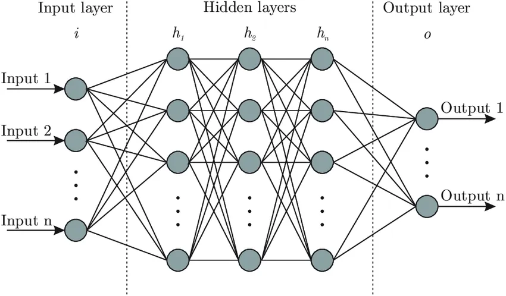 

  <figcaption>Figure 1 - A visualization of a neural network</figcaption>
</figure>

A neural network will have three basic components: the *input* layer, *hidden* (also called *intermediate*) layers and the *output* layer. There are several types of neural networks, but we will focus on feed-forward networks in this instance. Feed-forward networks always process information **in one direction**, that is, from the input towards the output layer. The layers between the input and output contain nodes or units that act somewhat like individual linear regression models. We can express the computation that happens in each layer by this model:

<figure>
  
 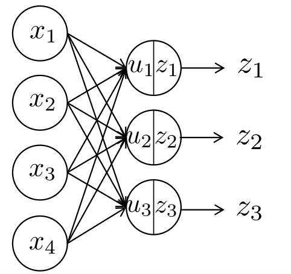 

  <figcaption>Figure 2 - A single layer neural network</figcaption>
</figure>

$$ u_j = \displaystyle\sum_{i = 1}^{I} w_{ji} x_i + b_j $$

$$ z_j = f(u_j) $$

In each node in each layer, the above computation is done. First, the inputs are all taken into one node, weighted by some weight designated for that node, and summed up. This sum is then modified by the *bias* $b_j$ of the node, which determines the value passed into the *activation function* $f$. The activation function determines the value passed into the next layer, usually between 0 and 1 or -1 to 1. In a multi-layered network, $z_j$ then becomes the input for the next layer, until the last layer which is the output layer. In a clustering neural network, this output layer will contain the scores of each class. The class with the highest score would then be picked for the object to be classified into.

### An example

We can better visualize neural networks by going through an example of a single-node neural network. Suppose on one weekend, we are trying to decide whether or not we want to go to the park. To do so, we list off all the deciding factors:

1. Is the weather good? (Yes: 1, No: 0)
2. Have we walked the dog in the past 3 days? (Yes: 1, No: 0)
3. Do they sell ice cream at the park? (Yes: 1, No: 0)
4. Do we have time to go to the park next weekend? (Yes: 0, No: 1)

Because these variables have different degrees of importance to us, we must also assign weights to the answers of these questions.

1. $w_1 = 5$, because we hate bad weather and the dog might get sick if it rains when we're at the park.
2. $w_2 = -3$, notice how the weight is **negative**, because having walked the dog in the past 3 days means we have *less* of a reason to go to the park. Compare this with the effect of the first variable, where it has a **positive** weight, and a "Yes" answer results in *more* of a reason to go to the park.
3. $w_3 = 2$, the effect of this variable is similar to variable 1, in that a *Yes* answer results in *more* of a reason to go, but the effect has less magnitude than variable 1. This may be because ice cream is not as important to us as the weather. 
4. $w_4 = 4$, notice how this time, we flipped the binary assignment: the value 1 is obtained if the answer is "No". This is just another way of setting up the input variables. If we don't have time to go to the park next weekend, we should go to the park this weekend, while we have time for it. This is why a "No" answer results in *more* of a reason to go to the park.

The answers to the questions determine our inputs $x$. This means we assign these values for $x$:

1. $x_1 = 1$, the sun is out, very few clouds in the sky and no rain is predicted for today.
2. $x_2 = 0$, the last time we walked our dog was last week.
3. $x_3 = 0$, they only have sandwiches at the park.
4. $x_4 = 1$, we have exams next week, which means we won't have time to go out.

Lastly, we assign the bias $b$ to be $-7$. This value is hard to describe in real world examples, as it is just a value that modifies the weighted sum of the inputs so that it can be passed into the activation function (which, in this case, decides whether or not we are going to the park). We can think of the bias as the *laziness factor*. A more negative value means we are less willing to go to the park, regardless of how important it is. A more positive value means we *want* to go to the park, even if it might not be very important.

Calculating the $u$, we have

$$ \begin{align*} u &= \displaystyle\sum_{i = 1}^{I} w_i x_i + b \\ &= \underbrace{1 \times 5}_{w_1x_1} + \underbrace{0 \times (-3)}_{w_2x_2} + \underbrace{0 \times 2}_{w_3x_3} + \underbrace{1\times4}_{w_4x_4} + \underbrace{(-7)}_{b} \\ u &= 2 \end{align*}$$

This value is then passed into the activation function $f$. Suppose we have set this system up so that we will go to the park if the obtained value of $u$ is larger than 0. We can model this mathematically by using a variation of the *Heaviside function*, also called the threshold function.

$$ z = f(u) = \begin{cases}0\quad\mathrm{for \: u \leq 0} \\ 1 \quad\text{for u > 0} \end{cases} $$

<figure>
  
 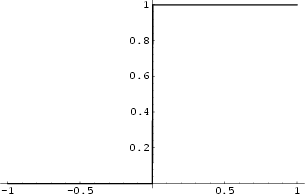 

  <figcaption>Figure 3 - The Heaviside function</figcaption>
</figure>

We obtain $ u = 2 > 0 \Rightarrow z = f(2) = 1 $. Since the output is $1$, we decide to go to the park. This is a hyper-simplification of the way our brain makes decisions. We weigh the different determining factors, apply a bias and then decide whether or not to do something. As there are only two options here, the output layer has two units: to go and not to go. In real-life and machine learning situations, however, there are many more factors that influence the output, and the output doesn't necessarily have to be binary. Considering how a single-node "network" already takes into account all these factors, we can imagine how extensive actual neural networks with hundreds or even thousands of nodes in different layers are. Every node takes into account multiple variables and weighs them differently, which then gets processed again by the next layer, and the next layer, and so on, until the decision making is so refined that it resembles that of a human's.

## What was done in Lecture 13

To set the foundation for Exercise 13.1, we must first understand what was done in Lecture 13 completely.

### Loading the machine and dataset

DeepLearnToolbox is an introductory machine learning library initially created for MATLAB, but works in Octave as well. The library is somewhat outdated, last updated almost 8 years ago, but it will suffice for the purposes of this report.

After cloning the <a href='https://github.com/rasmusbergpalm/DeepLearnToolbox'>GitHub repository</a>, the library was loaded into Octave by running:

~~~matlab
addpath('dlt/NN')
addpath('dlt/util')
~~~

*Note that I stored the DeepLearnToolbox master directory as `./dlt/`, with `./` as the project's root folder.*

This allows Octave to make use of the functions and reserved variable names defined in DeepLearnToolbox.

Next, the MNIST dataset is loaded in, this time using the larger 60000-image set for training and the 10000-image set for testing.

~~~matlab
% LOAD ALL DATA
% Load testing images dataset
fid=fopen('./mnist/t10k-images.idx3-ubyte','r','b');
fread(fid,4,'int32');
test_img=fread(fid,[28*28,10000],'uint8');
test_img=test_img';
fclose(fid);
% Load testing labels dataset
fid=fopen('./mnist/t10k-labels.idx1-ubyte','r','b');
fread(fid,2,'int32');
test_lbl=fread(fid,10000,'uint8');
fclose(fid);
% Loading training images dataset
fid=fopen('./mnist/train-images.idx3-ubyte','r','b');
fread(fid,4,'int32');
train_img=fread(fid,[28*28,60000],'uint8');
train_img=train_img';
fclose(fid);
% Loading training labels dataset
fid=fopen('./mnist/train-labels.idx1-ubyte','r','b');
fread(fid,2,'int32');
train_lbl=fread(fid,60000,'uint8');
fclose(fid);
~~~

C-style I/O was explained in the last report, so we can move on to data preparation.

### Dataset preparation and labeling

In machine learning, dataset preparation is important, as it might make or break the training process, which will in turn have a major effect on the produced model.

One of the most important steps in data preparation has been discussed in report 11, more specifically in the example of Principal Component Analysis (the GPA survey analogy). For the different types of data to contribute equally to the analysis, **standardization** is required.

As mentioned in report 11, standardization can be obtained by converting all numerical data points $x$ to $z$:

$$ z = \dfrac{x - \mu}{\sigma} $$

This will shift the mean of the data to be 0 and enforce the same scale on all types of data, effectively normalizing the effects they have.

After preparing the image data, we can now move on to creating one-hot vectors for the classes. This is essentially just another way of labeling the objects, telling the model which class the object actually belongs to.

~~~matlab
% One-hot vectors
A = eye(10,10);
train_d = A(train_lbl+1,:);
test_d = A(test_lbl+1,:);
~~~

To do this, we create an identity matrix of size 10x10. As indexing in Octave starts at `1` instead of `0`, we need to add 1 to the elements in `train_lbl` so that there will be no zero values. This means the values of `train_d` and `test_d` are going to be row vectors of zeros and a single 1 in a specific position, which is determined by the labels in `train_lbl` and `test_lbl`. Essentially, instead of telling the model a specific value like 4 or 6, we are giving the model the *position* of the class the object belongs to. For example, let's say the value of `train_lbl(1)` is equal to `4`. This means the handwritten digit in the first image is 4. Our code will tell the model that the correct class exists in the *fifth* position in the ten-element array. This is because the first position is occupied by the *zero* class, second position by the *one* class, and so on.

~~~matlab
train_lbl(1) = 4;
train_d(1) = A(train_lbl(1)+1,:);
train_d(1) =
  0
  0
  0
  0
  1
  0
  0
  0
  0
  0
~~~

### Neural network initialization

After data preparation and labeling, the neural network can now be constructed:

~~~matlab
% Initiate neural network
nn = nnsetup([784 100 10]); % Clears prior networks and sets up a new one
opts.numepochs = 1;
opts.batchsize = 100;
~~~

The first line sets up a neural network with 784 input units, 100 units in the intermediate layer and 10 output units. We have 784 input units because that is the number of pixels in our images, and 10 because that is the amount of different classes we have (from 0 to 9). `opts.numepochs` is a parameter that defines how many times the network "sees" a single image in each training. `opts.batchsize` sets how often the weights are updated. Setting it to `100` like we did means the weights are updated once the network has seen 100 images. 

To train the neural network, we pass the variable `nn` which is the name of the network we just set up, `train_img` for the training data, `train_d` for the one-hot vectors (as labeling) and `opts` for the options we just defined.

~~~matlab
% Train neural network then test the accuracy with test dataset
[nn,L] = nntrain(nn, train_img, train_d, opts);
pred = nnpredict(nn,test_img);
mean(pred-1 == test_lbl)*100 % Accuracy
~~~

Running the code gives us an accuracy around 92%:

<figure>
  
 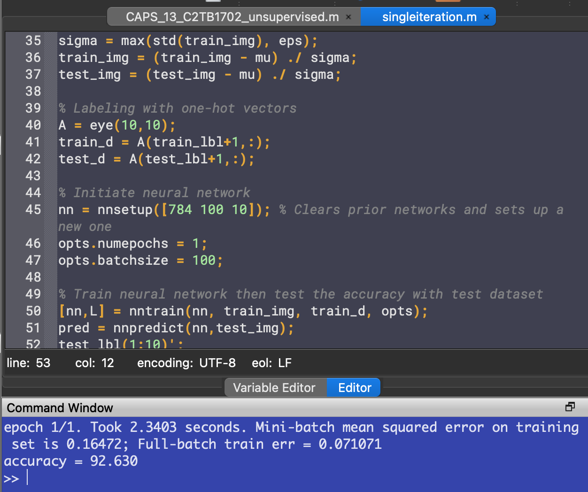 

  <figcaption>Figure 4 - The output of the script from lecture 13</figcaption>
</figure>

## Exercise 13.1

 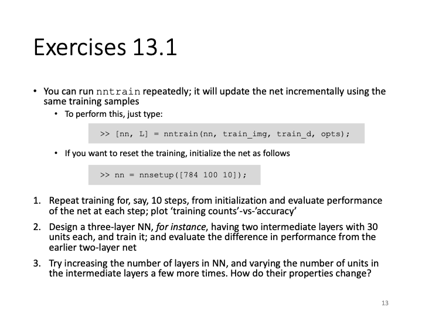 

### Problem 1: Improvement of accuracy with repeated training

We can train the network multiple times by putting the `nntrain()` command inside a `for` loop. We set the number of iterations to be 10.

~~~matlab
accuracy = [];
for i = 1:10
  [nn,L] = nntrain(nn, train_img, train_d, opts);
  pred = nnpredict(nn,test_img);
  test_lbl(1:10)';
  accuracy(i) = mean(pred-1 == test_lbl)*100 % Accuracy
endfor
~~~

To measure the accuracy, we take the average of a logical matrix defined by `pred-1 == test_lbl`. This compares the predictions with the labels of the testing dataset. Recall that as we added 1 to the classes' name earlier to avoid an indexing error, we need to subtract the names by 1 again so that correct guesses will actually match the labels, and not be shifted by 1.

This time, we store the accuracy of each iteration in a new element of the array `accuracy`, so that we can plot it later.

Running the code, we get accuracy numbers that have an increasing trend:

<figure>
  
 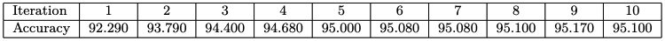 

  <figcaption>Figure 5 - The accuracy has an increasing trend.</figcaption>
</figure>

To plot the accuracy numbers against the number of iterations, 

~~~matlab
hold on
plot(accuracy, "color", "r");
plot(accuracy, 'o', "color", "r");
yl = ylim(); % Find limits of y axis to do adjustment for axis label placement
xlabel("Number of iterations")
ylabel("Accuracy of predictions (%)","position",[-1 (yl(1) + yl(2))/2])
~~~

<figure>
  
 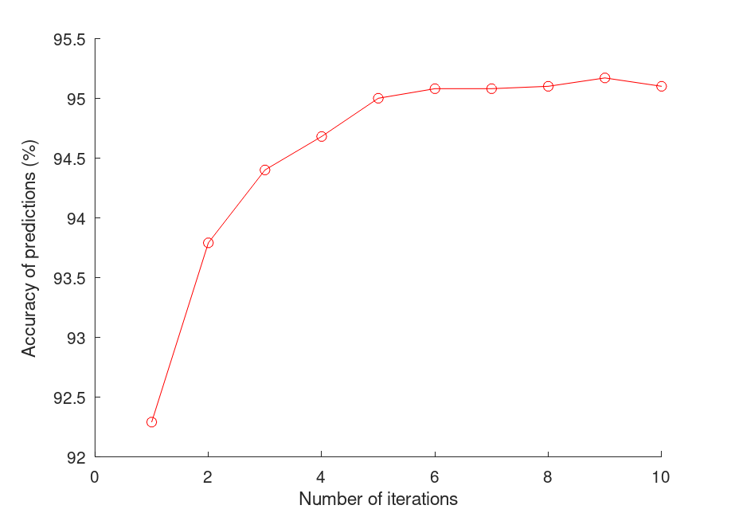 

  <figcaption>Figure 6 - Plot of the accuracy numbers gotten</figcaption>
</figure>

Without touching the neural network set-up, we're already able to achieve high accuracy numbers just by training the model multiple times. This is analogous to how the human brain learns. It might not have perfect accuracy the first few times, but given enough time to repeatedly do the same thing, it learns to do things a little differently each time, and learns how to do things better.

However, rather surprisingly, even though the trend of accuracy is going up, sometimes the number stagnates or even drops. This is because the model starts to **overfit** the dataset, meaning the predictors in the model are starting to overcomplicate the prediction process. As a result, the model gets *worse* at recognizing patterns in the data. As explained in lecture 12, this is similar to fitting polynomial functions to data points and setting the order too high. The predictor becomes meaningless as it also tries to describe *noise*, which are patterns in the data that are not as strong as the "correct" patterns, but exist as a result of natural error.

In the context of handwriting, this might be slight tendencies in some of the training data where some people's handwriting of 4s might look like 9s, but the pattern is not very strong, which makes the model ignore it in the first few iterations, but as the pattern gets reinforced in later iterations, the model starts to recognize it as a valid pattern, which lessens its accuracy when tested against the testing dataset. This is why when training a model, when the accuracy starts to plateau, or even drop, the model is starting to overfit. We need to stop the training and use the iteration with the highest accuracy.

### Problem 2: Modifying the neural network

Next, we can try modifying the neural network setup to see the effects it has on the accuracy of the model. To do so, we can change the elements of the vector in `nnsetup()`. More elements indicate more layers, while the numbers themselves represent how many units are in each layer.

~~~matlab
nn = nnsetup([784 30 30 10]); % Clears prior networks and sets up a new one
~~~

This will set up a neural network with two intermediate layers of 30 units each. Running the code again, we get these accuracy numbers:

<figure>
  
 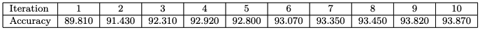 

  <figcaption>Figure 7 - Accuracy numbers with two 30-unit intermediate layers</figcaption>
</figure>

<figure>
  
 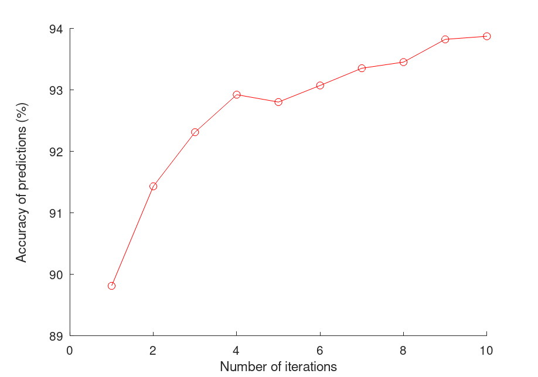 

  <figcaption>Figure 8 - Plot of accuracy numbers with modified layers </figcaption>
</figure>

We see that the trend of accuracy is still up, but the graph looks a bit more erratic. The model doesn't reach as high of an accuracy even after the tenth iteration, when compared to just the single-layer network. However, the training time was faster.

### Problem 3: Varying the layers and units

To see how units and layers change the accuracy of the NN, we can try isolating the two variables. First, we keep the number of intermediate layers constant at 2, and vary the number of units in each layer:

~~~matlab
% Keep number of layers and vary units
maxAccuracies = [];
j = 1;
for u = 30:10:100
  % Initiate neural network
  nn = nnsetup([784 u u 10]); % Clears prior networks and sets up a new one
  opts.numepochs = 1;
  opts.batchsize = 100;

  accuracy = [];
  for i = 1:10 % Train and evaluate accuracy 10 times
    [nn,L] = nntrain(nn, train_img, train_d, opts);
    pred = nnpredict(nn,test_img);
    accuracy(i) = mean(pred-1 == test_lbl)*100 % Accuracy
  endfor

  % Plot the acccuracy of each iteration
  hold on
  subplot(2, 4, j)
  plot(accuracy, 'o');
  yl = ylim(); % Find limits of y axis to do adjustment for axis label placement
  xlabel("Number of iterations")
  ylabel("Accuracy of predictions (%)","position",[-2 (yl(1) + yl(2))/2])
  title(sprintf("Units = %d", u))

  maxAccuracies(j) = max(accuracy); % Store the highest accuracy number

  j += 1;
endfor
axes('visible', 'off', 'title', 'Accuracy of neural networks with units per intermediate layer from 30 to 100' );
maxAccuracies
~~~

First, we set up a `for` loop that iterates from 30 through 100 with a step of 10. This means we are testing neural networks of 2 intermediate layers, with 30, 40, 50, 60, 70, 80, 90 and 100 units in each layer. Then we set up the neural network by passing the number of units we want into `nnsetup()`. Then for each specific unit number, we train and test the NN ten times, plot the accuracy numbers and store the maximum accuracy into an array for later use.

<figure>
  
 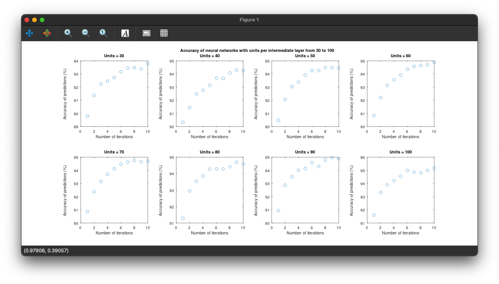 

  <figcaption>Figure 9 - The accuracy plots of neuralDigits.m</figcaption>
</figure>

If we see the maximum accuracy numbers, we get an increasing trend:

<figure>
  
 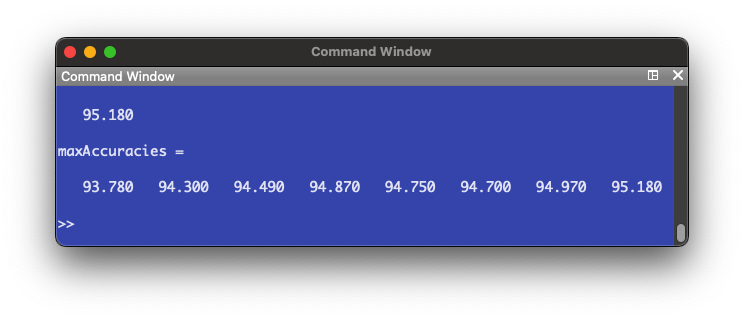 

  <figcaption>Figure 10 - The maximum accuracy has an increasing trend</figcaption>
</figure>

Next, we keep the number of units constant and change the number of layers. Doing this in a separate script to shorten run time,

~~~matlab
% Keep number of units and vary layers
% Initiate first neural network
nn = nnsetup([784 100 10]); % Clears prior networks and sets up a new one
opts.numepochs = 1;
opts.batchsize = 100;

accuracy = [];
for i = 1:10 % Train and evaluate accuracy 10 times
  [nn,L] = nntrain(nn, train_img, train_d, opts);
  pred = nnpredict(nn,test_img);
  accuracy(i) = mean(pred-1 == test_lbl)*100 % Accuracy
endfor

% Plot the acccuracy of each iteration
hold on
subplot(1, 3, 1)
plot(accuracy, 'o');
yl = ylim(); % Find limits of y axis to do adjustment for axis label placement
xlabel("Number of iterations")
ylabel("Accuracy of predictions (%)","position",[-2 (yl(1) + yl(2))/2])
title("1 intermediate layer")

maxAccuracies(1) = max(accuracy); % Store the highest accuracy number

% Initiate second neural network
nn = nnsetup([784 100 100 10]); % Clears prior networks and sets up a new one
opts.numepochs = 1;
opts.batchsize = 100;

accuracy = [];
for i = 1:10 % Train and evaluate accuracy 10 times
  [nn,L] = nntrain(nn, train_img, train_d, opts);
  pred = nnpredict(nn,test_img);
  accuracy(i) = mean(pred-1 == test_lbl)*100 % Accuracy
endfor

% Plot the acccuracy of each iteration
subplot(1, 3, 2)
plot(accuracy, 'o');
yl = ylim(); % Find limits of y axis to do adjustment for axis label placement
xlabel("Number of iterations")
ylabel("Accuracy of predictions (%)","position",[-2 (yl(1) + yl(2))/2])
title("2 intermediate layers")

maxAccuracies(2) = max(accuracy); % Store the highest accuracy number

% Initiate third neural network
nn = nnsetup([784 100 100 100 10]); % Clears prior networks and sets up a new one
opts.numepochs = 1;
opts.batchsize = 100;

accuracy = [];
for i = 1:10 % Train and evaluate accuracy 10 times
  [nn,L] = nntrain(nn, train_img, train_d, opts);
  pred = nnpredict(nn,test_img);
  accuracy(i) = mean(pred-1 == test_lbl)*100 % Accuracy
endfor

% Plot the acccuracy of each iteration
subplot(1, 3, 3)
plot(accuracy, 'o');
yl = ylim(); % Find limits of y axis to do adjustment for axis label placement
xlabel("Number of iterations")
ylabel("Accuracy of predictions (%)","position",[-2 (yl(1) + yl(2))/2])
title("3 intermediate layers")

maxAccuracies(3) = max(accuracy); % Store the highest accuracy number

maxAccuracies
~~~

We are just doing the same steps, but varying the number of layers this time. The following plots are produced:

<figure>
  
 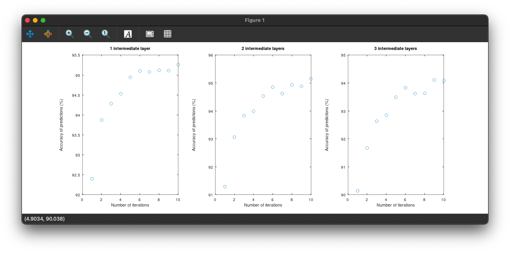 

  <figcaption>Figure 11 - Accuracy plots of variedLayers.m</figcaption>
</figure>

<figure>
  
 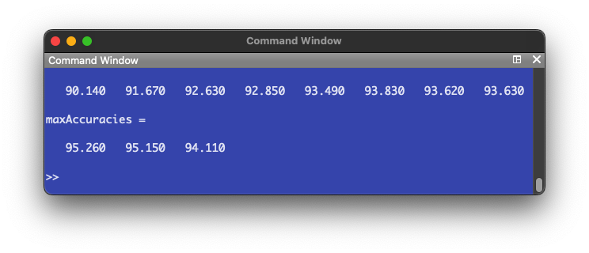 

  <figcaption>Figure 12 - The accuracy decreases as the number of layers increase.</figcaption>
</figure>

It appears additional layers don't have a positive effect on the accuracy of the NN. In fact, the accuracy decreases instead. Comparing to the number of units, where there was a trend of increasing accuracy, we can hypothesize that an efficient NN model would be one that has few intermediate layers and a larger amount of units in each layer.

To confirm this, we set up a one intermediate layer NN (like Problem 1) but this time with 300 units in the intermediate layer.

The following plot is produced:

<figure>
  
 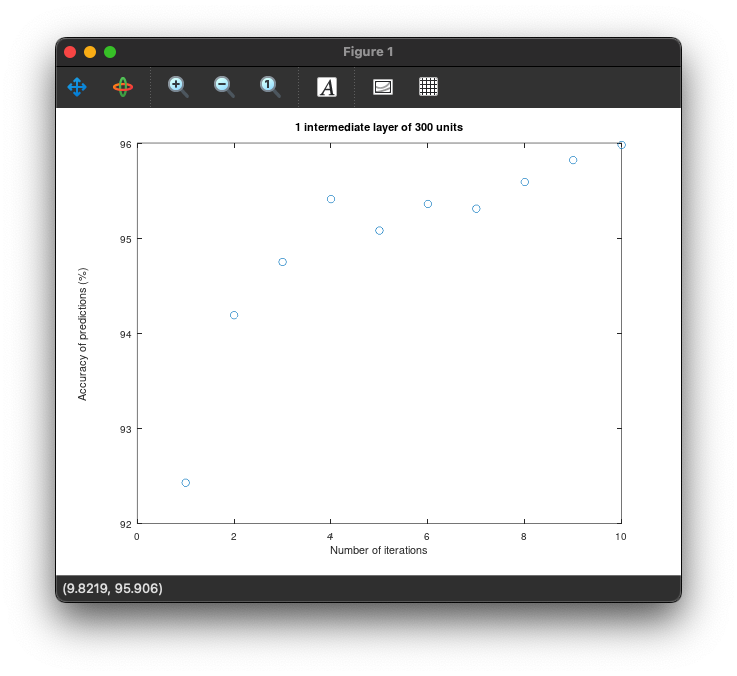 

  <figcaption>Figure 13 - The optimized model reaches a considerably high accuracy number</figcaption>
</figure>

<figure>
  
 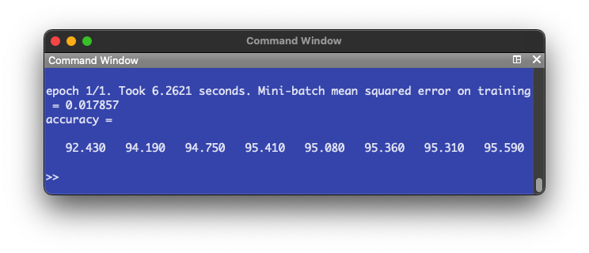 

  <figcaption>Figure 14 - The accuracy numbers for the optimized model</figcaption>
</figure>

The highest accuracy reached is 95.59%, which confirms our hypothesis.

## Footnote
1. While theory is important to build a foundation upon, in order to truly get the best results, learning from trial and error is always best, when possible.
2. Machine learning models are highly specific, in that there is no one model that is better than all the others at all tasks. Each task will have a different model that's optimized for it.
3. Machine learning starts from the data. If the quality of training data is bad, we can't expect the model to perform well. In order to create a well-performing model, we need to consider the data that the model will work on after training, design a training dataset with that in mind, and prepare it for training.

## Resources and further reading

1. <a href='https://www.ibm.com/cloud/blog/supervised-vs-unsupervised-learning'>Supervised vs. unsupervised learning</a>
2. <a href='https://www.ibm.com/topics/unsupervised-learning#:~:text=Unsupervised%20learning%2C%20also%20known%20as,the%20need%20for%20human%20intervention.'>An overview of unsupervised learning</a>
3. <a href='https://towardsdatascience.com/designing-your-neural-networks-a5e4617027ed'>Basics of neural network design</a>
4. <a href='https://arxiv.org/pdf/2108.02497.pdf'>Avoiding machine learning pitfalls</a>
5. <a href='https://thesai.org/Downloads/Volume11No7/Paper_19-Handwriting_Recognition_using_Artificial_Intelligence.pdf'>Handwriting Recognition using Artificial Intelligence</a>

 

[comment]: <> (Below is CSS code for the output HTML and pdf files. Don't touch them unless you know what you're doing.)

