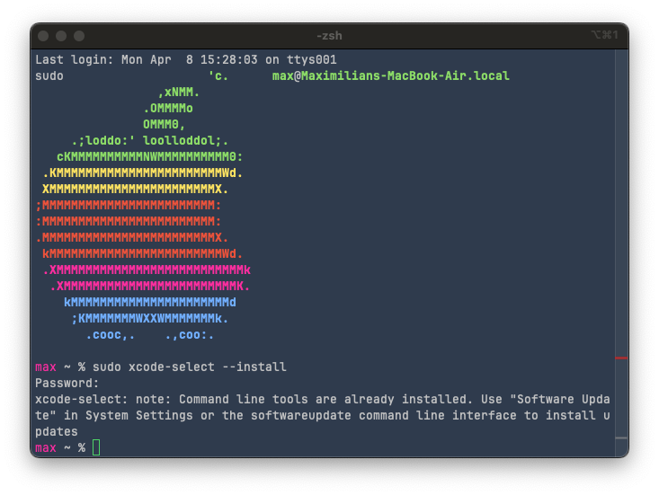
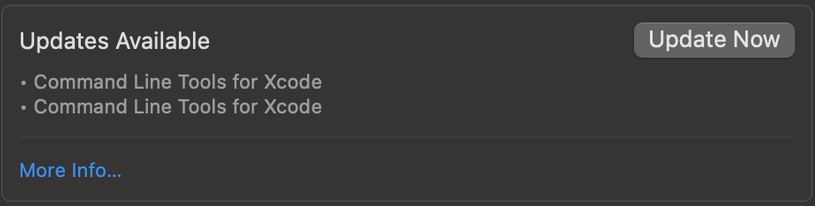
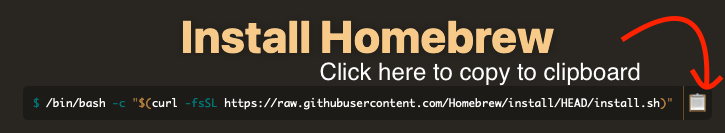
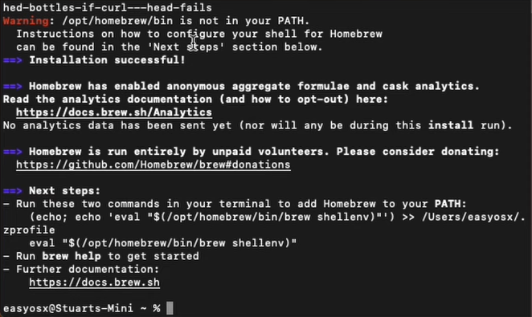
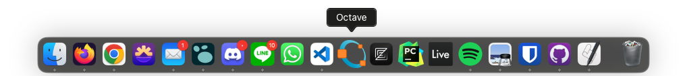

# Setting up Octave for MacOS

## Chip architecture

First, find out what kind of CPU your Mac has. If it's a 2020 or newer model year, it's most likely on Apple Silicon/ARM (M1, M2, or M3, at the time of writing). If it's older, it's probably Intel/x86. I have no experience with Intel-based Macs, so I can't really vouch for a specific way to install Octave, but the tutorial for Apple Silicon Macs *in theory* should work for Intel-based Macs, too. 

## Apple Silicon Macs

If you're on Apple Silicon, good. You will have the same or better experience than people running Windows or even Linux, although the installation process might not be as straightforward. You will also have access to the latest stable version of Octave, or even beta versions if you're feeling brave. At the time of writing, the latest stable version of Octave is version 9.1.0, so if the version numbers are different from the one you are installing at a later date, this is why.

### Pre-installation

If you prefer watching a video, click [here](https://www.youtube.com/watch?v=IWJKRmFLn-g).

First, make sure you have Xcode Command Line Tools installed. To do this, open a Terminal window (you can use terminal emulators like iTerm too if you like) and type in the following command:

```shell
sudo xcode-select --install
```

**Note: I recall the first installation taking quite a bit of time. I definitely recommend doing this at home since the download is pretty large.**

if the following is the response, you've already installed the command line tools and you're good to go.

<p align='center'>  </p>

Otherwise, I'm not sure what the expected behavior is in Ventura, because I installed it when my macbook ran Monterey. But if nothing happened, go to Settings > General > Software Update, and if you see "Updates Available" like so:

<p align='center'>  </p>

Click on Update Now, and wait until it finishes installing. To check if you installed everything correctly, run the following command in Terminal:

```shell
xcode-select -p
```

and if you get something like **/Library/Developer/CommandLineTools**, you're good to go.

Next, you want to get the Homebrew package manager. This is probably one of the most important pieces of software you want to get if you're doing any kind of serious work on a Mac. Essentially, a package manager does exactly what it says: it installs, updates, and removes packages. What are packages? Well, they can be a lot of things, but usually they are pieces of software, like Octave. Some pieces of software do not go on marketplaces like the Apple App Store for numerous reasons, so you can get them via package managers.

To get Homebrew, you can go to their homepage at [brew.sh](https://brew.sh), then copy and paste the command on the website to a terminal window.

<p align='center'>  </p>

then, type in your password to give sudo access and wait for the installation to finish.

**Note: you won't see anything appearing when you're typing in your password in the terminal window. This is normal in shell-based TUIs, just keep typing and press Enter when you're done.**

After brew is done installing, you will see instructions on how to add brew to your PATH. What this does is basically add the word "brew" to a sort of record that the computer keeps so that it know when you're typing "brew" in the terminal, you mean to use the program "brew". You can think of this as adding a shortcut of a game to your Desktop. Instead of having to look for the launcher executable in your File Explorer/Finder, you can just click on the shortcut instead. Similarly, instead of having to type out the full "address" of where we installed brew, we can just say "brew" instead. Neat!

The instructions will most likely look something like this:

<p align='center'>  </p>

So just do as it says, and copy the command starting with `(echo; echo 'eval...` up until `brew shellenv)"`. Then, paste it in and hit Enter. Note that you will just get another empty prompt with no confirmation or reply about what you've just done. This is normal.

To check if you have installed brew correctly, open a new tab in the Terminal by clicking the + button at the top right of the window, or by hitting Cmd+T. This will ensure that our terminal reads the "record" that we've updated with the "shortcut" to our brew installation. In the new terminal tab, type in the following:

```shell
brew update
```

Since you've just installed brew, you'll probably get the "Already up-to-date." reply, because you haven't installed any packages with it yet. If you *have* installed brew before, it might take a few seconds before listing a few updates to the packages you have installed. If you do get packages you can update, you can update them with:

```shell
brew upgrade
```

### Installing Octave with Homebrew

To install Octave via Homebrew on Apple Silicon Macs, type the following command:

```shell
brew install octave
```

Depending on your internet connection, it might take a while to install Octave, as it depends on a large amount of libraries and packages. When it's done installing, type the following to launch Octave in GUI mode:

```shell
octave --gui
```

You're good to go, but this way of running Octave is a bit messy. You always have to open a Terminal window and type in a command to open the application, and you can't close the terminal window while using Octave, or it will also close the application along with it. I have no problems with this method if it were a Linux machine running tiling window managers and everything runs on terminal commands, but this is MacOS, so there *has* to be a more elegant way.

### Beautifying the Octave installation

If you're willing to spend 3 more minutes tinkering with your installation, you can save a few seconds every time you want to launch Octave, and your windows will be a bit cleaner, too. I think this is valuable enough when you already have seven tabs open on Chrome trying to research whatever topic the class is covering, trying to explain your unexplainable code.

First, open the Script Editor via Launchpad, Spotlight Search or whatever launcher you use. Paste in the following command:

```applescript
do shell script "/opt/homebrew/bin/octave --gui"
```

then File > Export and make sure to change the file format to Application. The file extension should be ".app". Save the .app file in the "Applications" folder.

<p align='center'>  </p>

This will allow you to run octave using your search/launch bar (Cmd+space), like Spotlight Search, Alfred, or my personal favorite, Raycast.

<p align='center'>  </p>

Now you might notice that my launcher has the Octave logo, while yours might look something like this:

<p align='center'>  </p>

To change it, right-click on your .app file and click "Get Info". Alternatively, left-click on it once and hit Cmd+I. Then, right click on the image below to copy it. Click on the file logo in the info window, then hit Cmd+V to paste the logo in. You should have the new logo now.

<p align='center'>  </p>

You can also drag the .app file to your dock if you want to launch it that way.

<p align='center'>  </p>


## Intel-based Macs

At the time of writing, the oldest Apple Silicon macbooks are 4 years old. Aside from high-end x86 systems and Apple Silicon Macs, I would advise against running laptops older than five years old, especially if they're Intel-based Macs. They're noisy, hot, sips as much power as a small electric car and don't have much to offer in processing power. At this point, selling it and getting a base-model 2020 M1 MacBook Air would be the move IMO, since you'll get a **lot** for what you pay. At the time of writing, they are pretty cheap, with used ones going for as little as 80,000 yen in mint condition. This will take you very far for practically any IMAC-U course and general day-to-day computing needs.

If I can't dissuade you from using your 2019 16" MacBook Pro, that's completely fine. You can still run Octave on Intel-based Macs, although the support for it is quickly slowing down, as with any other software for MacOS. Theoretically, you can use the method above (for Apple Silicon Macs) just as well, but I've heard multiple (admittedly anecdotal) stories of people having trouble with it, from random crashes to straight up not being able to run. I think a more stable solution is the .dmg installers compiled by the octave.app project, accessible [here](https://github.com/octave-app/octave-app/releases). At the time of writing, the latest stable version is 6.2.0, and even the pre-release candidates are still at Octave 8.2.0.

If you're fine with running two or three major updates behind everyone else, this is probably the move. Note that even the 6.2.0 version is fairly recent (from 2021), so aside from a few small things, you probably won't notice any difference. Again, this is all speculation and my personal opinion, because I don't have any experience with Intel-based Macs, or older versions of Octave for that matter.


[comment]: <> (Below is CSS code for the output HTML and pdf files. Don't touch them unless you know what you're doing.)
<style>
    figcaption{
        text-align:center;
        font-size:9pt
    }
    img{
        filter: drop-shadow(0px 0px 7px );
    }
    .noshade{
        filter: none
    }
    .disclaimer{
        font-size: 9pt
    }
    .linker{
        color: inherit !important
    }
</style>