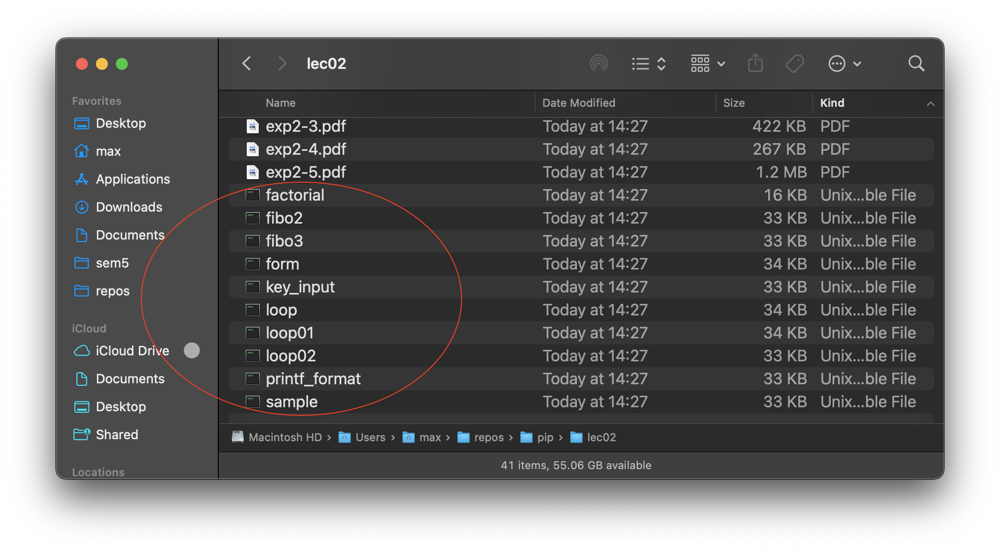

# PIP on macOS

C is a compiled language. This means in contrast to Python, which is an *interpreted* language, it needs a *compiler* to compile the source code into a *binary* which you an execute to run the program. On Windows, this binary will most likely have a .exe extension. On Unix-like systems like macOS and GNU-Linux, binaries don't have extensions. Instead, whether or not a file is executable is determined by the first few bytes of the binary. So, if you're on macOS or Linux, you will compile to binaries that look like this:

  

To run them, simply type in Terminal:

~~~shell
./filename
~~~

Remember to type **just** the filename, because this is the binary. The file with the .c extension is the *source file*, and you use it to write code, read code, and compile binaries. You **don't** use it to run the program itself, like you would with a Python file.

## How do I compile a source file into a binary?

Well, it's fairly simple. macOS comes with clang preinstalled. Clang is a compiler derived from LLVM (incredibly nerdy comprehensive open-source compiler project) for languages like C, C++, etc. To use this compiler, simply open a Terminal window, `cd` into the directory where your source file is located, and type:

~~~shell
clang filename.c -o filename
~~~

Of course, you can name the output file whatever you want. For example, to name it "miketyson" you just replace the word after `-o` like so:

~~~shell
clang filename.c -o miketyson
~~~

Wait a few seconds and once your shell prompt is back, you can execute the binary file created.

## Do I need to do this every single time I change the source file?

Yes. The binary file doesn't magically become aware that you've changed the source file, so to change the way your binary behaves, you need to make a new binary by compiling the source file again.

Now, if you don't know already, there's a way to recall commands you've entered in the terminal. Simply use the up arrow key to recall something you've previously typed into the terminal, and press enter to execute the same command. If you overshot it, just use the down arrow to go back.

For me, this was enough to not drive me crazy when there's an annoying bug somewhere that needs 70 trial-and-error compilations to fix. But, if you want to be *that* guy, you can use the VSCode extension Code Runner to do this for you. What this extension does, is run the command earlier *for you* every time you press the run button, or use the shortcut (default is control+option+n). It also executes the resulting binary code after the compilation (if no errors are encountered), so you can basically spam the compilation after making a change.

  

The $-identifiers are replaced by vscode to fit whatever directory and filename you're working with.

You'll probably notice though that the default compiler used for C is gcc. Now, I can't know for sure if gcc is preinstalled, so if you use this extension and it doesn't work, use brew to install it:

~~~shell
brew update
brew upgrade
brew install gcc
~~~

Otherwise, you should be all set for the class. There's nothing more you should know if you're not interested in how to develop programs in C. The majority of the work in this class is associated with understanding memory management concepts, and not how to work with the programming language per se. That said, if you're interested in the in and outs of C and C++ or how Unix systems work, I'm always down to chat :D

## Further reading because I like yapping: What's the difference between a compiled language and and interpreted language?

Simply put, a binary file is a file that contains instructions for the processor to execute. When we execute a binary file, we're basically telling the processor to run the instructions inside the binary file. We might not be able to read the contents of a binary file, but the processor understands it perfectly fine. Just like we can read a .c source file perfectly fine, but the processor can't understand it.

> **But what about .py files? I can execute them just fine!**
>  Since Python is an interpreted language, the Python interpreter (a separate program that you download as part of the package), which is perfectly able to read the file, translates it in real-time into instructions for the processor. When you "execute" a .py file, what you're actually doing is executing the python interpreter/runtime. This is clear to see when you have Python installed on bare metal (instead of using Google Colab), because the way you "execute" a .py file is by typing `python filename.py`. You're executing `python` and passing the `filename.py` argument to tell it what to do.

> **So why even use compiled languages? Python is easier to understand, understandable by both machine and humans, and runs perfectly fine!**
> Well, for the most part, you're right. There's almost no reason to use any language other than Python for things like data analysis and statistics. However, one major drawback of interpreted languages is its speed. Since compiled languages have all the instructions for the processor ready in a single file, they're just naturally much, much faster for heavy workloads. Also, since they're generally much lower level (meaning closer to machine language), they usually have more control over the memory, adding even more potential for processing speed if you know what you're doing.

I can talk about this for hours (literally, compilers are one of my research interests), but all you need to know is that compiled language fast, interpreted language slow. Compiled language hard to learn for human, interpreted language (generally) easy. The most important distinction is, compiled language (especially C) allows you to manipulate memory at the lowest level, which means if you take the time to learn how to do this, you'll have the fundamentals of a master programmer, and if you don't, these languages will **beat your ass**. This is actually why PIP is my favorite CS-related subject, because it teaches you the absolute fundamentals of how a computer works, and it makes literally *any* research paper intuitively understandable with a little googling.

As a bonus, if you take Fundamentals of Information Science I and II next year, the basics of the concepts about memory addresses and sorting algorithms are covered in this subject, so be sure to listen and really try to understand them. Good luck!