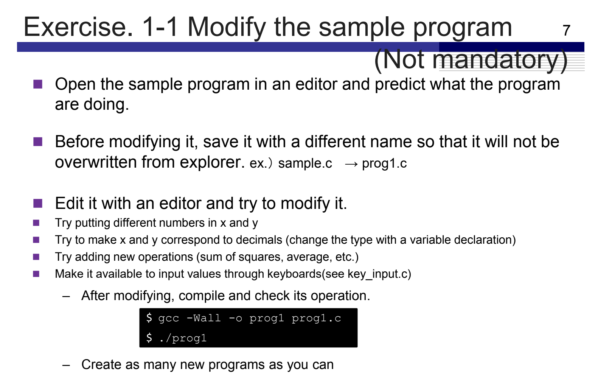

# Assignment 1

  

C files:
[prog1.c](./prog1.c)
[prog2.c](./prog2.c)
[prog3.c](./prog3.c)

[comment]: <> (Below is CSS code for the output HTML and pdf files. Don't touch them unless you know what you're doing.)

